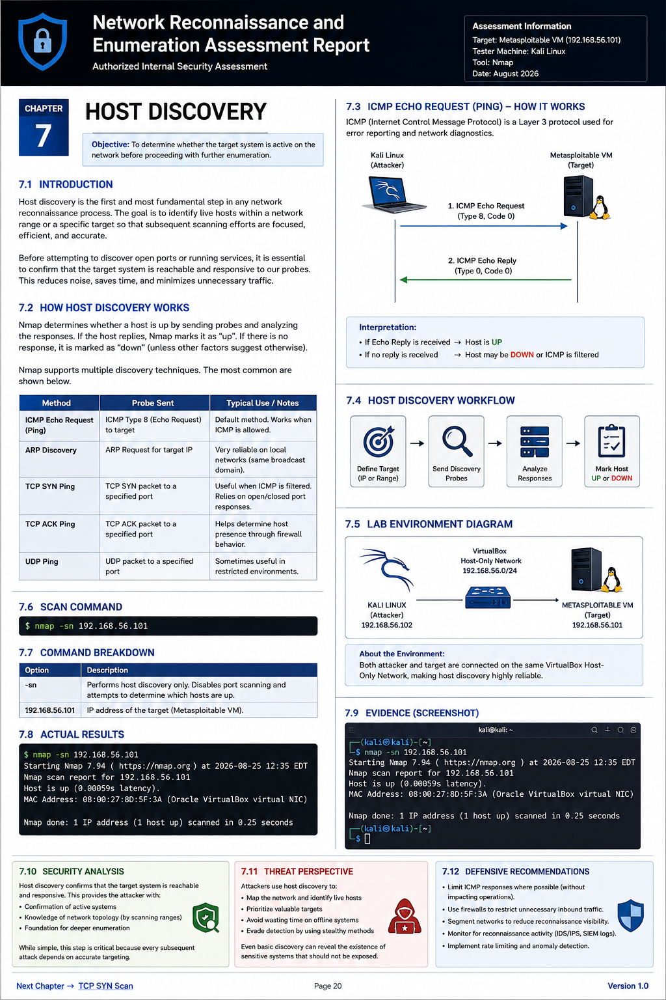

# Network Reconnaissance and Enumeration Assessment Report

---

## Assessment Information

| Item | Details |
|------|---------|
| Assessment Title | Network Reconnaissance and Enumeration |
| Assessment Type | Authorized Internal Security Assessment |
| Target System | Metasploitable Virtual Machine |
| Assessment Environment | VirtualBox Host-Only Network |
| Testing Machine | Kali Linux |
| Primary Tool | Nmap |
| Author | Babatunde Eletu |
| Report Version | 1.0 |
| Assessment Date | August 2026 |

---

# Executive Summary

This report documents the reconnaissance and enumeration phase of an authorized penetration testing exercise conducted against a Metasploitable virtual machine within a controlled laboratory environment.

The primary objective of this assessment was to identify active hosts, enumerate exposed network services, determine operating system characteristics, and gather technical intelligence required for later phases of a penetration test.

Network reconnaissance was performed using Nmap to conduct host discovery, TCP SYN scanning, service version detection, operating system fingerprinting, aggressive scanning, UDP enumeration, and Nmap Scripting Engine (NSE) scans. The information collected during these activities provides visibility into the target's exposed attack surface and establishes the foundation for vulnerability assessment.

Only reconnaissance and enumeration activities were performed during this phase. No exploitation, privilege escalation, password attacks, or denial-of-service testing were conducted.

---

# Table of Contents

1. Introduction
2. Assessment Objectives
3. Scope of Engagement
4. Lab Environment
5. Tools Used
6. Assessment Methodology
7. Host Discovery
8. TCP SYN Scan
9. Service Version Detection
10. Operating System Detection
11. Aggressive Scan
12. UDP Scan
13. NSE Script Scan
14. Security Findings
15. Recommendations
16. Conclusion
17. References

---

# 1. Introduction

Reconnaissance is the first technical phase of every penetration test. Before identifying vulnerabilities or attempting exploitation, security professionals must understand the target environment by identifying reachable systems, exposed services, operating systems, and available network resources.

The purpose of this assessment is to collect accurate technical information about the target while minimizing unnecessary network traffic. The information obtained during reconnaissance enables subsequent phases of a penetration test to be performed efficiently and methodically.

All activities documented in this report were conducted against an intentionally vulnerable virtual machine within a controlled laboratory environment for educational purposes.

---

# 2. Assessment Objectives

The objectives of this assessment were to:

- Verify that the target host is reachable.
- Identify exposed TCP and UDP services.
- Enumerate running applications and software versions.
- Determine the target operating system.
- Identify potential attack vectors.
- Document findings using industry-standard reporting practices.

---
# 3. Scope of Engagement

## In Scope

The following activities were authorized and performed during this assessment:

- Host discovery
- TCP SYN port scanning
- Service version detection
- Operating system detection
- Aggressive scanning
- UDP scanning
- Nmap Scripting Engine (NSE) enumeration

## Out of Scope

The following activities were intentionally excluded from this phase of the assessment:

- Exploitation of identified vulnerabilities
- Privilege escalation
- Password attacks
- Denial-of-Service (DoS) testing
- Persistence techniques
- Post-exploitation activities

The focus of this report is limited to reconnaissance and enumeration activities conducted within an authorized laboratory environment.

---

# 4. Lab Environment

The assessment was conducted in a controlled virtual laboratory to ensure that all scanning activities were authorized and posed no risk to production systems.

| Component | Description |
|-----------|-------------|
| Attacker Machine | Kali Linux |
| Target Machine | Metasploitable Virtual Machine |
| Virtualization Platform | Oracle VirtualBox |
| Network Type | Host-Only Network |
| Primary Tool | Nmap |

This isolated environment provides a safe platform for learning penetration testing techniques while preventing unintended interaction with external systems.

---

# 5. Tools Used

The following tools were used during the reconnaissance and enumeration phase of the assessment.

| Tool | Purpose |
|------|---------|
| Nmap | Host discovery, port scanning, service enumeration, OS detection and NSE scanning |
| Netcat | Banner grabbing and manual service verification |
| Kali Linux | Penetration testing operating system |

Each tool was selected because it is widely used by cybersecurity professionals and provides reliable capabilities for network reconnaissance.

---

# 6. Assessment Methodology

A structured methodology was followed throughout this assessment to ensure consistency, repeatability, and accurate documentation of findings.

The assessment was performed in the following sequence:

1. Host Discovery
2. TCP SYN Scan
3. Service Version Detection
4. Operating System Detection
5. Aggressive Scan
6. UDP Scan
7. NSE Script Enumeration
8. Analysis of Findings
9. Documentation and Reporting

Each phase builds upon the information gathered during the previous phase. This systematic approach minimizes unnecessary network traffic while ensuring that sufficient technical information is collected before progressing to more advanced stages of a penetration test.

---
# 7. Host Discovery

## Chapter Overview

Figure 7.1 provides a high-level overview of the host discovery process performed during this assessment. It illustrates the purpose of host discovery, the underlying network protocols, the discovery workflow, the laboratory environment, the Nmap command used, the observed results, and the associated security considerations discussed throughout this chapter.



*Figure 7.1 – Overview of the Host Discovery phase performed during the assessment.*

## 7.1 Introduction

Host discovery is the initial technical phase of network reconnaissance and serves as the foundation for every penetration test. Before attempting to identify open ports, enumerate services, fingerprint operating systems, or discover vulnerabilities, an assessor must first determine whether the target host is active and reachable on the network.

Attempting to scan an offline system results in wasted time, unnecessary network traffic, and incomplete reconnaissance. Consequently, professional penetration testers always verify host availability before proceeding with deeper enumeration activities.

Within this assessment, host discovery was conducted against the authorized Metasploitable virtual machine to confirm network connectivity and validate that the target was ready for further analysis.

---
## 7.2 Understanding Host Discovery

Host discovery is the process of determining whether a device is active and reachable on a network before performing detailed enumeration. It is the first operational step in network reconnaissance because scanning an offline or unreachable system wastes time and generates unnecessary network traffic.

Rather than immediately attempting to identify open ports or running services, Nmap first attempts to determine whether the target is alive. This is accomplished by transmitting carefully crafted network probes and analyzing the responses returned by the target system.

If a valid response is received, Nmap classifies the host as **up**. If no response is received, the host may be offline, unreachable, or protected by a firewall that blocks the discovery probes.

This process allows penetration testers to focus their efforts on active systems, improving both the efficiency and accuracy of the assessment.

---

## 7.3 Why Host Discovery is the First Step

Every penetration test follows a logical sequence. Each stage depends on the information gathered during the previous phase.

```

```
                 Penetration Testing Workflow

      Reconnaissance
             │
             ▼
      Host Discovery
             │
             ▼
       Port Scanning
             │
             ▼
    Service Enumeration
             │
             ▼
   Vulnerability Assessment
             │
             ▼
        Exploitation
             │
             ▼
   Privilege Escalation
             │
             ▼
      Post-Exploitation
```

```markdown
Host discovery acts as the foundation of this workflow. Before identifying services or vulnerabilities, the tester must first confirm that the target system is accessible. Skipping this step could result in inaccurate findings or unnecessary scans against inactive devices.

In enterprise environments containing hundreds or thousands of hosts, proper host discovery dramatically reduces scan duration by eliminating inactive systems before detailed enumeration begins.

---

## 7.4 The Internet Control Message Protocol (ICMP)

The Internet Control Message Protocol (ICMP) is a core network protocol within the Internet Protocol (IP) suite. Unlike TCP and UDP, ICMP is not used to transport application data. Instead, it is responsible for reporting network errors, providing diagnostic information, and assisting devices in determining whether communication across a network is functioning correctly.

One of the most common uses of ICMP is the **Echo Request** and **Echo Reply** mechanism, commonly known as a **ping**. This simple exchange enables one device to verify that another device is reachable across the network.

During host discovery, Nmap frequently relies on ICMP to determine whether a target system is online. If the target responds with an Echo Reply, Nmap considers the host to be active and available for further reconnaissance.

Although ICMP is widely used for troubleshooting and diagnostics, many organizations restrict or block ICMP traffic at firewalls to reduce the amount of information exposed to potential attackers. As a result, a system that does not respond to ICMP is not necessarily offline—it may simply be configured to ignore ICMP requests.

---

## 7.5 ICMP Echo Request and Echo Reply

The ICMP Echo Request/Echo Reply process is straightforward and consists of four primary steps.

1. The attacker sends an ICMP Echo Request to the target.
2. The request travels across the network.
3. If the target is online and configured to respond, it returns an ICMP Echo Reply.
4. Upon receiving the reply, Nmap confirms that the host is active.

This exchange forms the basis of traditional network "ping" operations and is one of the fastest methods for verifying host availability.

The sequence can be summarized as follows:

```

```
Attacker (Kali Linux)                  Target (Metasploitable)

ICMP Echo Request  ------------------------------->

                          Processing Request

ICMP Echo Reply   <-------------------------------

Host Confirmed Alive
```

```markdown

When an Echo Reply is successfully received, Nmap records the target as **Host is Up**, allowing the assessment to proceed to the next phase of reconnaissance.

---

## 7.6 Limitations of ICMP-Based Host Discovery

Although ICMP Echo Requests provide a fast and efficient method for determining whether a host is online, they are not always reliable in modern network environments.

Many organizations configure firewalls, routers, and intrusion prevention systems to block or ignore ICMP traffic. This reduces the amount of information available to unauthorized users and makes network reconnaissance more difficult.

As a result, the absence of an ICMP Echo Reply does not necessarily indicate that a host is offline. Instead, it may simply mean that ICMP traffic is being filtered by a security device.

To overcome this limitation, Nmap supports several alternative host discovery techniques, including ARP, TCP SYN, TCP ACK, and UDP discovery. These methods enable Nmap to identify active hosts even when ICMP traffic is restricted.

---

## 7.7 Address Resolution Protocol (ARP)

The Address Resolution Protocol (ARP) is responsible for mapping IPv4 addresses to physical Media Access Control (MAC) addresses on a Local Area Network (LAN).

Before one device can communicate with another over Ethernet, it must first determine the destination device's MAC address. ARP performs this task by broadcasting an ARP Request across the local network.

A typical ARP exchange follows these steps:

1. The attacker broadcasts an ARP Request asking, **"Who has this IP address?"**
2. Every device on the local network receives the request.
3. Only the device that owns the requested IP address responds.
4. The responding device sends an ARP Reply containing its MAC address.
5. Communication between the two devices can now begin.

Unlike ICMP, ARP is fundamental to local Ethernet communication. A host cannot communicate on a local network without first resolving MAC addresses. Because of this, systems that ignore ICMP requests will usually still respond to ARP Requests.

For this reason, Nmap automatically prefers ARP Discovery when scanning hosts on the same local Ethernet network, making it one of the fastest and most reliable host discovery techniques available.

---

## 7.8 Why ARP Was Effective in This Assessment

The assessment environment consisted of a Kali Linux virtual machine and a Metasploitable virtual machine connected through a VirtualBox Host-Only network.

Since both systems were located on the same Layer 2 network segment, ARP-based discovery was highly effective. Nmap was able to confirm the presence of the target host quickly and reliably before beginning port scanning and service enumeration.

This demonstrates one of the key advantages of performing host discovery within a local laboratory environment: address resolution occurs directly between the participating systems without requiring communication through external routers or internet infrastructure.

---

## 7.9 Host Discovery Command Analysis

After understanding the networking concepts behind host discovery, the next step is to examine how Nmap performs this process in practice.

The following command was executed to determine whether the target system was active before beginning further reconnaissance.

```bash
nmap -sn 192.168.56.101
```

### Command Breakdown

| Command Component | Description |
|-------------------|-------------|
| `nmap` | Launches the Nmap network scanning utility. |
| `-sn` | Performs host discovery only. No port scan is performed. |
| `192.168.56.101` | IP address of the target Metasploitable virtual machine. |

The `-sn` option instructs Nmap to determine whether the target host is online without performing port enumeration. This makes the scan significantly faster than a traditional port scan and reduces unnecessary network traffic.

Host discovery is considered a best practice because it verifies target availability before investing time in more detailed reconnaissance.

---

## 7.10 Practical Execution

The host discovery scan was initiated from the Kali Linux attack machine against the Metasploitable virtual machine located on the VirtualBox Host-Only network.

The objective of this scan was to verify that the target host was powered on, connected to the network, and capable of responding to discovery probes.

### Command Executed

```bash
nmap -sn 192.168.56.101
```

The scan completed successfully and confirmed that the target system was reachable from the attacker's machine.

---

## 7.11 Host Discovery Results

The host discovery scan produced the following key findings:

- The target host responded successfully to the discovery probe.
- Network connectivity between the attacker and target was confirmed.
- The target was identified as active and ready for further assessment.
- The MAC address of the target was successfully identified.
- The hardware vendor was recognized as Oracle VirtualBox, confirming that the assessment was conducted within a virtualized laboratory environment.

### Evidence

Insert your Host Discovery terminal screenshot below.

```markdown

```

This screenshot provides evidence that the target host was successfully identified before moving to the next phase of the penetration testing process.

---

## 7.12 Technical Analysis

Although the host discovery scan appears simple, it provides valuable intelligence to a penetration tester.

First, it confirms that the target is online and reachable, eliminating uncertainty before more detailed scanning begins.

Second, identifying the MAC address reveals information about the network interface vendor. In this assessment, the vendor was identified as Oracle VirtualBox, indicating that the target was running inside a virtualized environment. This information helps the assessor better understand the target infrastructure and can influence subsequent testing strategies.

Finally, confirming host availability reduces unnecessary network traffic by preventing detailed scans from being performed against inactive systems. This improves both the efficiency and accuracy of the assessment while minimizing the likelihood of generating misleading results.

Host discovery therefore serves as the foundation upon which every subsequent reconnaissance activity depends.

---

## 7.13 Security Implications

Host discovery is often viewed as a low-risk activity because it does not directly exploit vulnerabilities. However, from a security perspective, it provides valuable intelligence that can be leveraged during later stages of an attack.

By identifying active hosts, an attacker can:

- Determine which systems are currently available for further reconnaissance.
- Reduce the scope of subsequent port scans to active devices only.
- Identify network infrastructure and virtualized environments.
- Gather information that assists with vulnerability assessment and exploitation.

Although host discovery alone does not compromise a system, it represents the first stage of the Cyber Kill Chain. Detecting and responding to reconnaissance activity allows defenders to identify potential threats before exploitation attempts begin.

---

## 7.14 Defensive Recommendations

Organizations should implement layered security controls to reduce the effectiveness of unauthorized host discovery.

Recommended defensive measures include:

- Configure firewalls to restrict unnecessary ICMP traffic.
- Implement network segmentation to limit reconnaissance across network boundaries.
- Deploy Intrusion Detection and Intrusion Prevention Systems (IDS/IPS) capable of detecting scanning activity.
- Enable centralized logging and continuous monitoring to identify unusual network reconnaissance patterns.
- Apply the principle of least privilege when configuring network services and access controls.
- Conduct regular network assessments to identify exposed systems before attackers do.

While completely preventing host discovery is often impractical, these controls significantly increase the difficulty of reconnaissance and improve an organization's ability to detect malicious activity.

---

## 7.15 Key Takeaways

The host discovery phase established the foundation for the remainder of the penetration testing assessment.

Key observations include:

- The target system was successfully confirmed as online.
- Network communication between Kali Linux and the Metasploitable virtual machine was verified.
- The target's MAC address and virtualization vendor were successfully identified.
- The assessment confirmed that the target was ready for further enumeration.
- Host discovery provided the confidence required to proceed with TCP SYN scanning and service enumeration.

Although simple in execution, host discovery is one of the most important phases of network reconnaissance because every subsequent assessment activity depends on accurately identifying live systems.

---

## 7.16 References

1. Lyon, G. F. *Nmap Network Scanning: The Official Nmap Project Guide to Network Discovery and Security Scanning.*
2. RFC 792 – Internet Control Message Protocol (ICMP).
3. RFC 826 – Address Resolution Protocol (ARP).
4. Nmap Project Documentation.
5. OWASP Web Security Testing Guide – Information Gathering Methodology.

---

## 7.2 Learning Objectives

After completing this chapter, the reader should be able to:

- Explain the purpose of host discovery.
- Describe why host discovery is the first step in network reconnaissance.
- Understand how Nmap determines whether a host is online.
- Differentiate between common host discovery techniques.
- Interpret the results of an Nmap host discovery scan.
- Identify defensive measures that reduce network reconnaissance.

---

## 7.3 Why Host Discovery Matters

Network reconnaissance begins by answering one fundamental question:

**Is the target system actually online?**

Although this appears to be a simple question, answering it accurately is critical.

Enterprise networks may contain thousands of IP addresses assigned to servers, workstations, printers, network appliances, cameras, and virtual machines. Not every assigned address represents an active device. Some systems may be powered off, disconnected from the network, or temporarily unavailable.

Scanning every possible IP address without first determining host availability significantly increases scan duration and produces unnecessary network traffic. Host discovery eliminates inactive systems from consideration and allows subsequent enumeration to focus only on responsive hosts.

For this reason, host discovery is considered the gateway to every successful penetration test.

---
## 7.4 The Theory Behind Host Discovery

Host discovery is based on a simple principle: a device must respond to network communication before it can be considered active. To determine whether a system is online, Nmap transmits one or more network probes and waits for a response. If a valid response is received, the host is considered alive. If no response is received, the host may be offline, unreachable, or protected by a firewall that blocks the probe.

The type of probe used depends on the network environment and the scan options selected. Different discovery methods exist because modern networks often implement security controls that prevent certain types of traffic from reaching their destination.

For example, many organizations block ICMP Echo Requests at their perimeter firewalls to reduce reconnaissance opportunities. In such environments, relying solely on a traditional ping would incorrectly suggest that the target is offline. To overcome this limitation, Nmap supports multiple host discovery techniques, each designed to work under different network conditions.

The most common host discovery methods include:

- ICMP Echo Request Discovery
- ARP Discovery
- TCP SYN Discovery
- TCP ACK Discovery
- UDP Discovery

Selecting the appropriate discovery technique depends on factors such as network location, firewall configuration, operating system behavior, and the objectives of the assessment.

---

## 7.5 Host Discovery Techniques

### 7.5.1 ICMP Echo Request Discovery

The Internet Control Message Protocol (ICMP) is primarily used for diagnostics and error reporting. One of its best-known functions is the Echo Request and Echo Reply mechanism, commonly referred to as a "ping."

When an ICMP Echo Request is sent to a target host, a system that is online and configured to respond returns an ICMP Echo Reply. This exchange confirms that the device is reachable across the network.

Because of its simplicity, ICMP-based discovery is often the first technique used to verify host availability. However, many enterprise networks restrict or completely block ICMP traffic to reduce the amount of information exposed to potential attackers.

Consequently, the absence of an ICMP reply does not necessarily indicate that a system is offline. It may instead indicate that ICMP traffic is being filtered by a firewall or security device.

---

### 7.5.2 ARP Discovery

The Address Resolution Protocol (ARP) operates at the Data Link Layer and is responsible for mapping IPv4 addresses to physical MAC addresses on a local network.

When two devices are connected to the same local network segment, a system must first determine the destination MAC address before Ethernet communication can occur. This is achieved by broadcasting an ARP Request asking:

> "Who has this IP address?"

If the target owns that IP address, it responds with an ARP Reply containing its MAC address.

Because ARP is fundamental to local network communication, ARP discovery is extremely reliable within Local Area Networks (LANs). Even hosts that ignore ICMP requests typically respond to ARP Requests because communication cannot occur without successful address resolution.

For this reason, Nmap automatically prefers ARP-based host discovery when scanning hosts on the same Ethernet network.
---

### 7.5.3 TCP SYN Discovery

TCP SYN Discovery uses Transmission Control Protocol (TCP) packets to determine whether a host is online. Instead of sending an ICMP Echo Request, Nmap transmits a TCP SYN packet to one or more commonly used ports, such as TCP port 80 (HTTP) or TCP port 443 (HTTPS).

If the target host is active and the destination port is open, it typically responds with a SYN/ACK packet, indicating that it is prepared to establish a TCP connection. If the port is closed, the target generally responds with a TCP Reset (RST) packet. Although these responses differ, both confirm that the target host is online because a response was received.

TCP SYN Discovery is particularly useful when ICMP traffic is blocked by firewalls but TCP traffic is permitted. Because many organizations allow HTTP and HTTPS traffic through their network perimeter, TCP SYN Discovery often succeeds where traditional ICMP-based discovery fails.

---

### 7.5.4 TCP ACK Discovery

TCP ACK Discovery operates by sending a TCP ACK packet instead of a SYN packet. Since an ACK packet does not represent the beginning of a normal TCP connection, most hosts respond with a TCP Reset (RST) packet.

The purpose of TCP ACK Discovery is not to establish a connection but to determine whether the host is reachable. A returned RST packet confirms that the target system received and processed the packet, indicating that it is online.

TCP ACK Discovery can also provide insight into firewall behavior because some filtering devices treat ACK packets differently from SYN packets. This makes the technique useful during reconnaissance in environments where packet filtering rules are in place.

---

### 7.5.5 UDP Discovery

Unlike TCP, the User Datagram Protocol (UDP) is connectionless and does not establish a session before transmitting data. This characteristic makes UDP host discovery less predictable than TCP or ICMP-based techniques.

When a UDP probe is sent to a closed UDP port, many operating systems respond with an ICMP "Destination Unreachable – Port Unreachable" message. This response confirms that the host is active even though the UDP port itself is closed.

If no response is received, the host may be offline, the packet may have been filtered, or the application listening on that UDP port may simply ignore the probe. As a result, UDP-based discovery is generally slower and less reliable than ICMP or ARP discovery.

---

## 7.6 How Nmap Chooses a Host Discovery Technique

Nmap is designed to automatically select the most appropriate discovery technique based on the target environment and the user's scan options.

When scanning devices on the same Ethernet network, Nmap typically prefers ARP Discovery because it is fast and highly reliable. Every IPv4 device on a local network must use ARP to communicate, making ARP requests an effective method for identifying active hosts.

When scanning remote networks, Nmap generally relies on ICMP Echo Requests together with TCP and UDP probes. If ICMP traffic is filtered, Nmap can still identify active systems by interpreting TCP or UDP responses.

The flexibility to combine multiple discovery methods is one of Nmap's strengths. Rather than depending on a single protocol, it adapts its probing strategy to maximize the likelihood of accurately identifying live hosts while minimizing unnecessary traffic.

---

## 7.7 Host Discovery in This Assessment

This assessment was performed in a VirtualBox Host-Only network consisting of a Kali Linux attacker machine and a Metasploitable virtual machine.

Because both systems resided on the same isolated local network, host discovery was straightforward and highly reliable. Nmap was able to confirm that the target was reachable before any port scanning or service enumeration was performed.

Establishing host availability at this stage ensured that all subsequent reconnaissance activities were directed toward a valid and responsive target, providing a solid foundation for the remainder of the assessment.

---
## 7.8 Host Discovery Command Breakdown

The following Nmap command was used to verify that the target system was active before beginning further reconnaissance.

```bash
nmap -sn 192.168.56.101
```

### Command Breakdown

| Component | Description |
|----------|-------------|
| `nmap` | Launches the Nmap network scanning utility. |
| `-sn` | Performs host discovery only. This option disables port scanning and instructs Nmap to determine whether the target is online. |
| `192.168.56.101` | The IP address of the target Metasploitable virtual machine. |

The `-sn` option (formerly known as `-sP` in older versions of Nmap) performs host discovery without attempting to identify open ports. This makes it an efficient method for confirming connectivity before proceeding with more detailed reconnaissance.

---

## 7.9 Practical Execution

Host discovery was performed at the beginning of the assessment to verify that the Metasploitable virtual machine was powered on, connected to the Host-Only network, and capable of responding to network traffic.

Executing this step before port scanning ensured that subsequent scans would target a live system, preventing unnecessary scan time and avoiding misleading results caused by scanning an unavailable host.

The assessment was conducted from the Kali Linux attack machine using the Nmap host discovery option.

### Command Executed

```bash
nmap -sn 192.168.56.101
```

---

## 7.10 Scan Results

The scan successfully confirmed that the target host was active and reachable.

Nmap reported that the target responded to the discovery probe, indicating that the virtual machine was online and accessible from the attacker's system.

The scan also identified the target's Media Access Control (MAC) address and correctly recognized the network interface vendor as Oracle VirtualBox, confirming that the assessment was being conducted within a virtualized laboratory environment.

### Screenshot

> **Insert your Host Discovery screenshot here.**

Example:

```markdown

```

---

## 7.11 Analysis of Results

The successful response demonstrates that communication between the Kali Linux attacker machine and the Metasploitable target was functioning correctly.

Several important observations can be made from this simple scan:

1. The target virtual machine was powered on and connected to the Host-Only network.
2. Network connectivity between the attacker and target was verified.
3. The target responded to Nmap's discovery probes, confirming that it was available for further assessment.
4. The detected Oracle VirtualBox MAC address confirmed that the system was operating inside a virtualized environment.
5. Because the host was confirmed to be active, subsequent reconnaissance activities such as TCP SYN scanning and service enumeration could proceed with confidence.

Although host discovery does not reveal vulnerabilities, it establishes the foundation upon which every later stage of a penetration test depends.

---