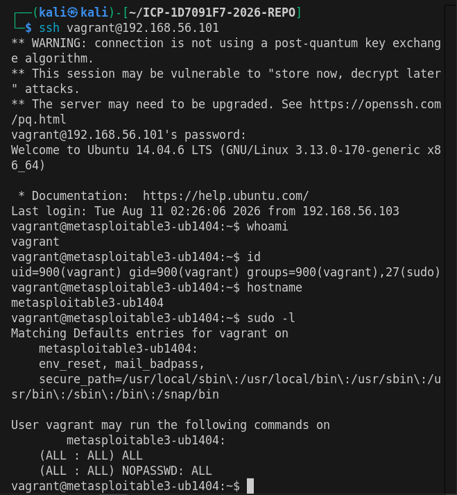
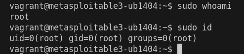

# Privilege Escalation Assessment

## Project 7: Penetration Testing Lab

**Target:** Metasploitable3 Ubuntu 14.04
**Target IP:** `192.168.56.101`
**Initial User:** `vagrant`
**Assessment Area:** Local Privilege Escalation

---

## 1. Target Session Verification

### Command

```bash
whoami
id
hostname
```

### What it does

* `whoami` identifies the currently authenticated user.
* `id` displays the user's UID, GID, and group memberships.
* `hostname` identifies the system on which the commands are being executed.

### Why we're running it

Before performing privilege-escalation testing, we need to establish the identity and context of the current session. This confirms that the assessment is being performed against the intended Metasploitable3 target rather than the Kali attacker machine.

### Output

```text
whoami
vagrant

id
uid=900(vagrant) gid=900(vagrant) groups=900(vagrant),27(sudo)

hostname
metasploitable3-ub1404
```

### Screenshot



**Screenshot:** `privilege-escalation-target-verification.png`

### Finding

The authenticated account is `vagrant` on the `metasploitable3-ub1404` target. The account is a member of the `sudo` group, which indicates that further sudo privilege enumeration is warranted.

---

## 2. Sudo Privilege Enumeration

### Command

```bash
sudo -l
```

### What it does

`sudo -l` lists the commands that the current user is permitted to execute through `sudo`, including any restrictions and authentication requirements.

### Why we're running it

We are checking whether the compromised or authenticated `vagrant` account has permissions that could allow local privilege escalation to root.

### Output

```text
Matching Defaults entries for vagrant on
metasploitable3-ub1404:
    env_reset, mail_badpass,
    secure_path=/usr/local/sbin:/usr/local/bin:/usr/sbin:/usr/bin:/sbin:/bin:/snap/bin

User vagrant may run the following commands on
metasploitable3-ub1404:
    (ALL : ALL) ALL
    (ALL : ALL) NOPASSWD: ALL
```

### Screenshot

The `sudo -l` output was captured together with the target verification commands:


**Screenshot:** `privilege-escalation-target-verification.png`

### Finding

The `vagrant` account has unrestricted sudo privileges.

The important entry is:

```text
(ALL : ALL) NOPASSWD: ALL
```

This means the `vagrant` account can execute commands as any user and group, including `root`, without being required to provide a sudo password.

This represents a **critical privilege-escalation weakness** in the intentionally vulnerable lab environment.

---

## 3. Root Privilege Verification

### Command

```bash
sudo whoami
sudo id
```

### What it does

* `sudo whoami` executes `whoami` with elevated privileges and identifies the effective user.
* `sudo id` displays the UID, GID, and group memberships of the elevated process.

### Why we're running it

The previous `sudo -l` enumeration identified unrestricted passwordless sudo access. These commands safely verify whether that permission actually results in root-level execution.

### Output

```text
sudo whoami
root

sudo id
uid=0(root) gid=0(root) groups=0(root)
```

### Screenshot



**Screenshot:** `privilege-escalation-root-verification.png`

### Finding

The privilege-escalation condition was successfully verified.

The `sudo whoami` command returned:

```text
root
```

and `sudo id` confirmed:

```text
uid=0(root) gid=0(root) groups=0(root)
```

UID `0` represents the root account on Linux. Therefore, the `vagrant` account can successfully execute commands with root privileges without password authentication.

### Security Impact

If an attacker obtains valid access to the `vagrant` account, the unrestricted `NOPASSWD: ALL` configuration allows immediate execution of commands with root privileges.

This results in complete compromise of the operating system and its data within the scope of this lab.

---

## Privilege Escalation Summary

| Test                         | Result                      | Significance                                   |
| ---------------------------- | --------------------------- | ---------------------------------------------- |
| Target identity verification | Confirmed `vagrant`         | Established initial access context             |
| Group enumeration            | `vagrant` belongs to `sudo` | Indicates elevated privileges may be available |
| `sudo -l`                    | `NOPASSWD: ALL`             | Unrestricted sudo access identified            |
| `sudo whoami`                | `root`                      | Root execution confirmed                       |
| `sudo id`                    | `uid=0(root)`               | Root-level privileges technically verified     |

### Overall Finding

**Critical — Unrestricted Passwordless Sudo Privileges**

The `vagrant` account has unrestricted passwordless sudo permissions, allowing commands to be executed as root. This provides a direct privilege-escalation path from the `vagrant` account to full system-level privileges.

---

## Evidence Files

* `screenshots/privilege-escalation-target-verification.png`
* `screenshots/privilege-escalation-root-verification.png`

## Assessment Note

All privilege-escalation testing documented in this report was performed against the intentionally vulnerable Metasploitable3 laboratory environment.
