# Week 2 – Network Scanning & Enumeration

## Professional Network Assessment Report

## Project Overview

This project demonstrates a comprehensive network scanning and enumeration assessment conducted against a Metasploitable3 virtual machine using Kali Linux. The objective was to identify live hosts, discover open ports, enumerate running services, identify the target operating system, and collect information that could support a penetration testing engagement.

All testing was performed in a controlled lab environment with authorization. Industry-standard tools such as Nmap and the Nmap Scripting Engine (NSE) were used to perform reconnaissance and service enumeration while documenting the findings in a professional report.

## Introduction

Network reconnaissance is a critical phase of penetration testing and security assessments, as it enables security professionals to identify active hosts, discover open ports, determine running services, and gather information about target systems before conducting further analysis. One of the most widely used tools for this purpose is Nmap (Network Mapper), an open-source network scanning utility capable of performing a variety of host discovery and port scanning techniques.

This assessment was conducted against a Metasploitable3 virtual machine within an isolated lab environment for educational purposes. All activities were performed with proper authorization.

## Objectives

- Verify target host availability.
- Discover open TCP and UDP ports.
- Identify running services and software versions.
- Perform operating system fingerprinting.
- Enumerate services using Nmap NSE scripts.
- Assess potential vulnerabilities.
- Document findings in a professional technical report.

## Lab Environment

| Component | Details |
|-----------|---------|
| Attacker Machine | Kali Linux |
| Target Machine | Metasploitable3 |
| Virtualization Platform | Oracle VirtualBox |
| Network Configuration | Host-Only Network |
| Primary Tool | Nmap 7.98 |
| Assessment Type | Authorized Lab Assessment |

## Table of Contents

- [Executive Summary](#executive-summary)
- [Engagement Overview](#engagement-overview)
- [Assessment Methodology](#assessment-methodology)
- [Lab Environment](#lab-environment)
- [Reconnaissance and Host Discovery](#reconnaissance-and-host-discovery)
- [TCP Port Scanning](#tcp-port-scanning)
- [Service Enumeration](#service-enumeration)
- [Operating System Detection](#operating-system-detection)
- [NSE Script Scanning](#nse-script-scanning)
- [UDP Port Scanning](#udp-port-scanning)
- [Web Enumeration](#web-enumeration)
- [SMB Enumeration](#smb-enumeration)
- [FTP Enumeration](#ftp-enumeration)
- [SSH Enumeration](#ssh-enumeration)
- [Vulnerability Assessment](#vulnerability-assessment)
- [Findings Summary](#findings-summary)
- [Recommendations](#recommendations)
- [Conclusion](#conclusion)
- [References](#references)
- [Appendix](#appendix)

---

# Executive Summary

*To be completed as the assessment progresses.*

---

# Engagement Overview

*To be completed.*

---

# Assessment Methodology

The assessment followed a structured reconnaissance methodology using Nmap to identify active hosts, discover open ports, identify running services, perform operating system detection, and enumerate available network services.

---

# Reconnaissance and Host Discovery

The first phase of the assessment was to determine whether the target host was online and reachable. Nmap host discovery confirmed that the Metasploitable3 virtual machine was active on the network.

## Host Discovery Overview


## Command Used

```bash
nmap -sn 192.168.56.101
```

## Scan Output Screenshot


## Findings

- Host successfully responded to ICMP requests.
- Target was confirmed online.
- MAC address identified as Oracle VirtualBox virtual NIC.
- Ready for further enumeration.

---

# TCP Port Scanning

## Overview

Following successful host discovery, a TCP SYN scan was performed to identify open TCP ports on the target system. The TCP SYN scan, commonly referred to as a half-open scan, is one of Nmap's most efficient reconnaissance techniques for discovering active network services. Instead of completing the full TCP three-way handshake, the scanner sends a SYN packet and analyzes the target's response to determine whether a port is open, closed, or filtered.

This scanning technique enables security professionals to rapidly enumerate exposed services while generating minimal network traffic. The results obtained during this phase establish the foundation for subsequent service enumeration, operating system fingerprinting, and vulnerability assessment activities.

## TCP SYN Scan Overview


## Command Used

```bash
sudo nmap -sS -p 1-1000 192.168.56.101
```

## Command Output Screenshot


## Findings

The TCP SYN scan successfully identified five open TCP ports on the target system within the first 1,000 TCP ports scanned. These ports indicate active services that are accessible over the network and warrant further enumeration.

| Port | State | Service |
|------|-------|---------|
| 21 | Open | FTP |
| 22 | Open | SSH |
| 80 | Open | HTTP |
| 445 | Open | Microsoft-DS (SMB) |
| 631 | Open | Internet Printing Protocol (IPP) |

Additionally, Nmap reported that 995 TCP ports were filtered (no response), indicating that probe packets did not receive a reply from the target. The target host responded with a low latency of approximately 1.4 ms, confirming reliable connectivity within the isolated laboratory environment.


---

## Technical Analysis

The TCP SYN scan utilized Nmap's half-open scanning technique to identify the state of TCP ports without completing the full TCP three-way handshake. During the scan, Nmap transmitted TCP SYN packets to the target system and analyzed the responses to determine the state of each port.

An open port responded with a SYN/ACK packet, indicating that a service was actively listening for incoming connections. Nmap then immediately terminated the connection by sending a Reset (RST) packet, preventing the handshake from completing. Closed ports responded with an RST packet, while filtered ports either failed to respond or were blocked by network filtering devices such as firewalls or packet filtering rules.

The scan completed in approximately 5.97 seconds and identified five accessible TCP services on the target host. These services provide the foundation for subsequent service version detection, operating system fingerprinting, vulnerability assessment, and service-specific enumeration during the later phases of the engagement.

## Security Assessment

The TCP SYN scan revealed multiple network services exposed on the target system, including FTP, SSH, HTTP, SMB, and IPP. Each exposed service represents a potential entry point that could be exploited if vulnerabilities, weak configurations, or outdated software are present.

The presence of FTP may expose risks associated with insecure authentication or anonymous access if not properly configured. SSH is generally considered secure but may be susceptible to brute-force attacks or weak credential policies. The HTTP service may expose web application vulnerabilities, while SMB has historically been associated with several high-impact vulnerabilities when left unpatched or misconfigured. The Internet Printing Protocol (IPP) should also be reviewed to ensure it is necessary and securely configured.

Although a TCP SYN scan does not directly identify vulnerabilities, it provides a comprehensive inventory of exposed services that should be prioritized for further enumeration, version detection, and targeted security testing during the subsequent phases of the assessment.

## Defensive Recommendations

To reduce the attack surface identified during the TCP SYN scan, the following security measures are recommended:

* Disable or remove unnecessary network services that are not required for business operations.
* Restrict access to critical services such as SSH and SMB using firewall rules, network segmentation, or access control lists (ACLs).
* Regularly apply security patches and software updates to all exposed services.
* Replace insecure protocols with secure alternatives where appropriate and enforce strong authentication mechanisms.
* Monitor network traffic for unauthorized scanning activity using intrusion detection or intrusion prevention systems (IDS/IPS).
* Conduct routine network vulnerability assessments and penetration tests to identify newly exposed services and validate existing security controls.

## Key Takeaway

The TCP SYN scan efficiently identified the target's exposed TCP services while minimizing network traffic through the use of the half-open scanning technique. The results established a reliable inventory of accessible network services, providing the necessary foundation for service enumeration, operating system detection, and vulnerability assessment during the subsequent phases of the penetration testing engagement.

## Conclusion

The TCP SYN scan successfully identified five open TCP ports and confirmed the availability of several network services on the target system. The information gathered during this phase established the target's network exposure and provided a structured basis for deeper service enumeration and security analysis. The next phase of the assessment will focus on identifying service versions and software banners to determine potential vulnerabilities associated with each exposed service.

# Service Version Detection

## Overview

Following the identification of open TCP ports, a service version detection scan was performed to determine the applications and software versions running on each exposed service. Nmap's service detection engine probes open ports using protocol-specific requests and analyzes the responses to accurately identify running services, software versions, and supported protocols.

This information enables security professionals to identify outdated software, correlate versions with publicly disclosed vulnerabilities (CVEs), and prioritize systems requiring remediation or further investigation during a penetration testing engagement.

## Service Version Detection Overview


## Command Used

```bash
sudo nmap -sV -T4 192.168.56.101
```
## Command Output Screenshot


## Findings

The service version detection scan successfully identified the software and version information associated with the exposed network services on the target system. In addition to confirming the previously discovered open ports, the scan revealed specific applications, service banners, and operating system information that support further vulnerability assessment.

| Port | Service | Version |
|------|---------|---------|
| 21 | FTP | ProFTPD 1.3.5 |
| 22 | SSH | OpenSSH 6.6.1p1 Ubuntu 2ubuntu2.13 |
| 80 | HTTP | Apache httpd 2.4.7 (Ubuntu) |
| 445 | SMB | Samba smbd 3.X–4.X |
| 631 | IPP | CUPS 1.7 |
| 3306 | MySQL | MySQL (unauthorized) |
| 8080 | HTTP | Jetty 8.1.7.v20120910 |

The scan also identified two closed ports (3000 and 8181), confirmed the target hostname as **METASPLOITABLE3-UB1404**, and identified the operating system as a Unix/Linux-based host. The scan completed in approximately **12.85 seconds**.

---

## Technical Analysis

Nmap's service version detection (`-sV`) performs active fingerprinting by sending protocol-specific probes to each discovered open port and analyzing the responses. The collected banners are compared against Nmap's service fingerprint database to accurately identify applications, software versions, and supported protocols.

The scan successfully identified several commonly deployed services, including ProFTPD, OpenSSH, Apache HTTP Server, Samba, CUPS, MySQL, and Jetty. This information provides a detailed inventory of the software running on the target system and establishes the foundation for vulnerability research by correlating identified versions with publicly disclosed Common Vulnerabilities and Exposures (CVEs).

---

## Security Assessment

The service version detection scan identified multiple applications and software versions that should be evaluated against publicly disclosed vulnerabilities and vendor security advisories. Services such as ProFTPD, Apache HTTP Server, Samba, Jetty, and CUPS have historically been associated with security vulnerabilities when running outdated or unsupported versions.

The MySQL service responded with an **"unauthorized"** message, confirming that the database service is reachable over the network. Although authentication prevented access during this phase, unnecessary exposure of database services increases the attack surface and should be carefully reviewed.

The operating system fingerprint also confirmed that the target is a Linux-based host, providing valuable context for subsequent enumeration and vulnerability assessment. While the version detection scan does not directly identify exploitable vulnerabilities, it supplies the critical information required to prioritize further testing.

---

## Defensive Recommendations

- Regularly update exposed services to supported versions with the latest security patches.
- Disable or remove services that are not required for operational purposes.
- Restrict access to SSH, MySQL, and SMB using firewall rules or network segmentation.
- Limit exposure of web applications and administrative interfaces to trusted networks.
- Perform regular vulnerability assessments to identify outdated software.
- Continuously monitor exposed services for configuration changes and suspicious activity.

---

## Key Takeaway

Service version detection provides a detailed inventory of the software running on exposed network services. This information enables security professionals to correlate identified versions with known vulnerabilities, prioritize remediation efforts, and focus subsequent penetration testing activities on the systems presenting the highest potential risk.

---

## Conclusion

The service version detection scan successfully identified the applications, software versions, and operating system information associated with the target's exposed services. These findings provide the technical foundation required for vulnerability assessment, service-specific enumeration, and informed security decision-making during the remaining phases of the penetration testing engagement.


# Service Enumeration

## Command Output Screenshot

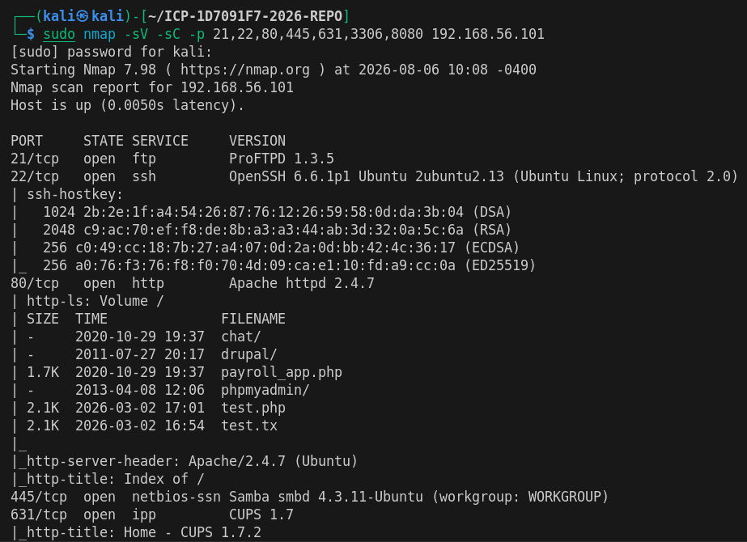

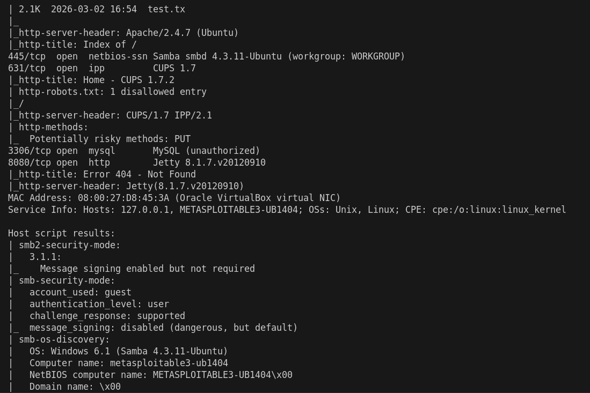

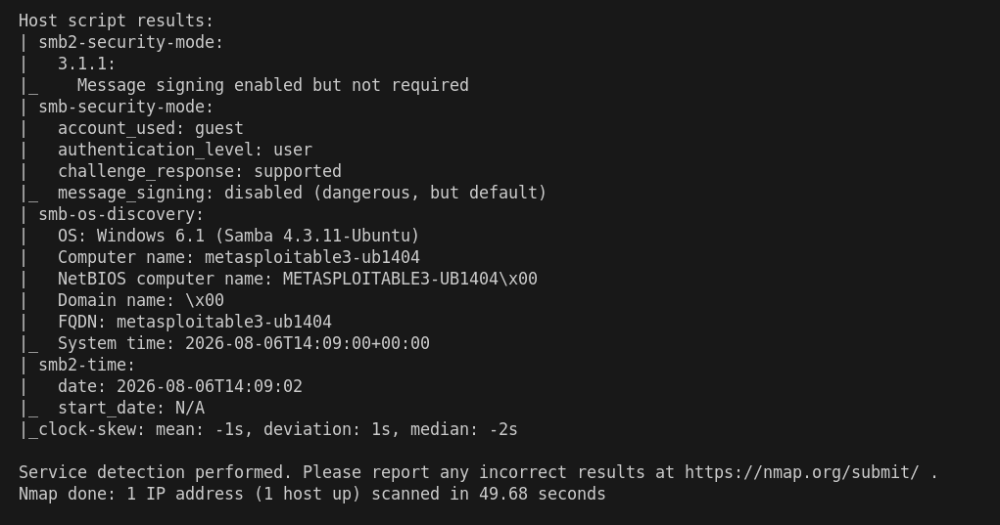

## Findings

The service enumeration phase was performed to gather additional information about the services identified during the service version detection scan. Nmap default NSE scripts (`-sC`) were used together with service version detection (`-sV`) to identify service configurations, exposed resources, and potential security weaknesses.

| Port | Service | Enumeration Findings |
|------|---------|---------------------|
| 21 | FTP | ProFTPD 1.3.5 was identified. No anonymous FTP access information was disclosed during enumeration. |
| 22 | SSH | SSH host keys were successfully retrieved, including RSA, DSA, ECDSA, and ED25519 keys. |
| 80 | HTTP | Directory listing was enabled, exposing directories including `/chat/`, `/drupal/`, `/phpmyadmin/`, and files such as `payroll_app.php`. |
| 445 | SMB | Samba 4.3.11 identified. Guest authentication was detected and SMB message signing was disabled. |
| 631 | CUPS | CUPS 1.7.2 web interface identified. Potentially risky HTTP PUT method detected. |
| 3306 | MySQL | MySQL service was reachable, but authentication was required. |
| 8080 | HTTP | Jetty 8.1.7.v20120910 identified. Server returned HTTP 404 response. |

## Technical Analysis

Service enumeration provides deeper visibility into the configuration and behavior of exposed network services. While service version detection identifies running software, enumeration attempts to discover additional information such as authentication mechanisms, available resources, and security settings.

The scan revealed several important findings, including exposed web directories, SMB security configuration weaknesses, and accessible network services requiring further security assessment.

## Security Assessment

The enumeration results identified multiple security concerns:

- Web directory listing exposes additional files and application paths that may contain sensitive information.
- SMB guest access and disabled message signing increase the potential for unauthorized access and relay attacks.
- Exposed administrative applications such as phpMyAdmin should be restricted.
- Outdated services require vulnerability assessment and patch management.

## Defensive Recommendations

- Disable directory listing on web servers.
- Restrict access to administrative web applications.
- Enable SMB message signing where possible.
- Disable unnecessary guest access.
- Remove or update outdated services.
- Apply security patches regularly.
- Limit exposure of database services to trusted networks only.

## Key Takeaway

Service enumeration provides valuable intelligence about exposed services, configurations, and potential weaknesses. The collected information assists security professionals in prioritizing vulnerability assessments and planning further penetration testing activities.

## Conclusion

The service enumeration phase successfully expanded the understanding of the target system's exposed services. The findings revealed important security issues including web directory exposure, SMB configuration weaknesses, and potentially vulnerable service configurations. These results provide the foundation for further vulnerability analysis and exploitation testing.

---

# Operating System Detection

## Command Output Screenshot

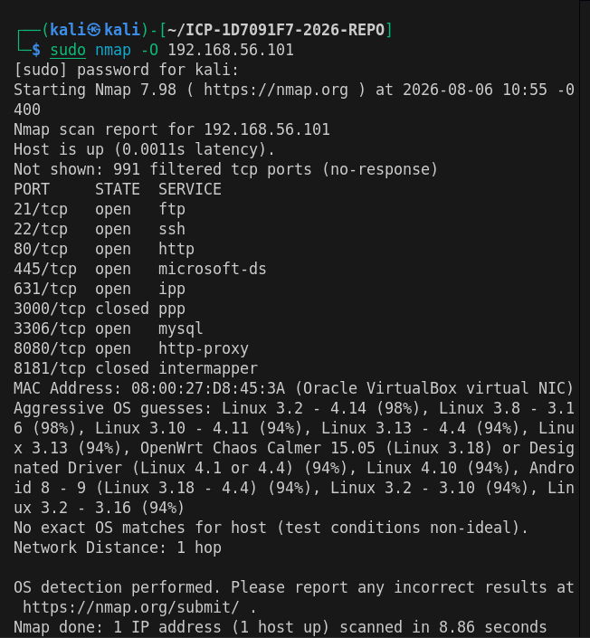

## Findings

The operating system detection scan was performed using Nmap's OS fingerprinting capability (`-O`) to identify the underlying operating system and system characteristics of the target host.

The scan confirmed that the target system was active and running multiple exposed services, including FTP, SSH, HTTP, SMB, IPP, MySQL, and an additional HTTP service. Nmap was unable to determine an exact operating system match; however, it identified several high-confidence Linux kernel fingerprints.

| Category | Result |
|----------|--------|
| Operating System Family | Linux |
| Best OS Guess | Linux 3.2 - 4.14 |
| Confidence Level | 98% |
| Network Distance | 1 hop |
| Exact OS Match | Not identified |

## Technical Analysis

Nmap OS detection works by analyzing TCP/IP stack characteristics, including packet responses, TCP window sizes, IP identification patterns, and protocol behavior. These fingerprints are compared against Nmap's operating system database to estimate the target platform.

The scan produced multiple Linux-based fingerprints with the highest confidence indicating a Linux kernel version range between 3.2 and 4.14. The inability to obtain an exact match is likely due to virtualization characteristics and differences between the target system configuration and Nmap's fingerprint database.

## Security Assessment

Identifying the operating system provides important context for vulnerability analysis and helps determine relevant attack paths. The Linux identification confirms that future testing should focus on Linux-specific vulnerabilities, service configurations, and privilege escalation opportunities.

The exposed services identified during OS detection, including SSH, SMB, HTTP, and database services, should be reviewed for outdated software versions and insecure configurations.

## Defensive Recommendations

- Keep the operating system updated with current security patches.
- Remove unnecessary exposed services.
- Apply secure configuration standards to network services.
- Monitor Linux hosts for unauthorized changes.
- Regularly perform vulnerability assessments.

## Key Takeaway

OS detection provides valuable information about the underlying platform hosting exposed services. Although an exact operating system match was not obtained, the scan successfully identified the target as a Linux-based system, supporting further vulnerability assessment activities.

## Conclusion

The operating system detection scan successfully identified the target host as a Linux-based system with high-confidence kernel fingerprint matches. This information provides additional context for vulnerability research and supports the selection of appropriate penetration testing techniques.

---

# NSE Script Scanning

## Command Output Screenshots

### Default NSE Scripts (`-sC -sV`)

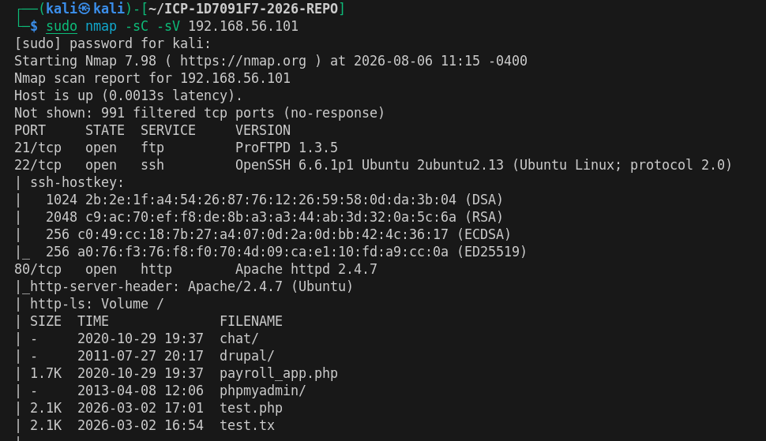

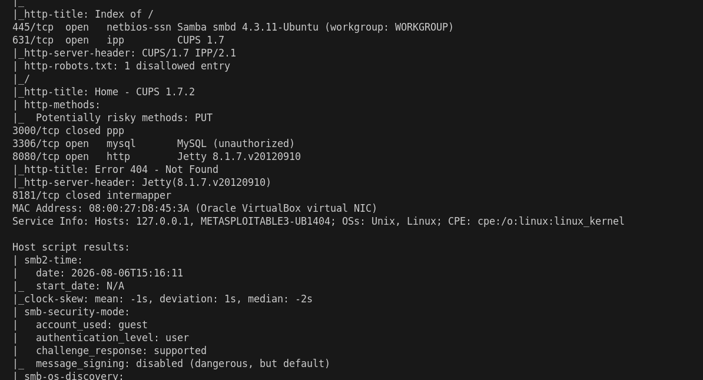

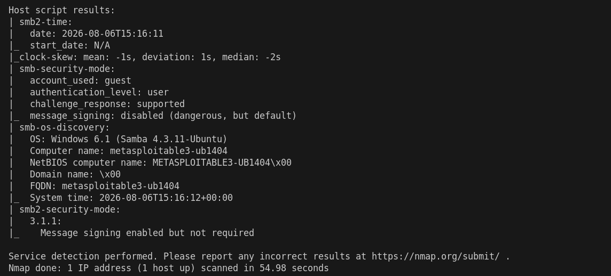

### Vulnerability NSE Scripts (`--script vuln`)

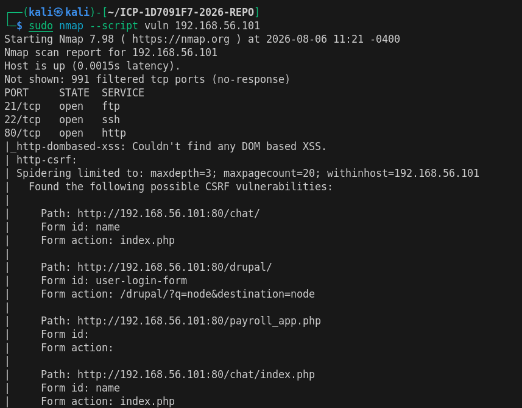

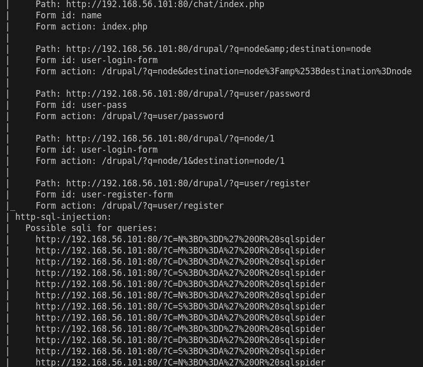

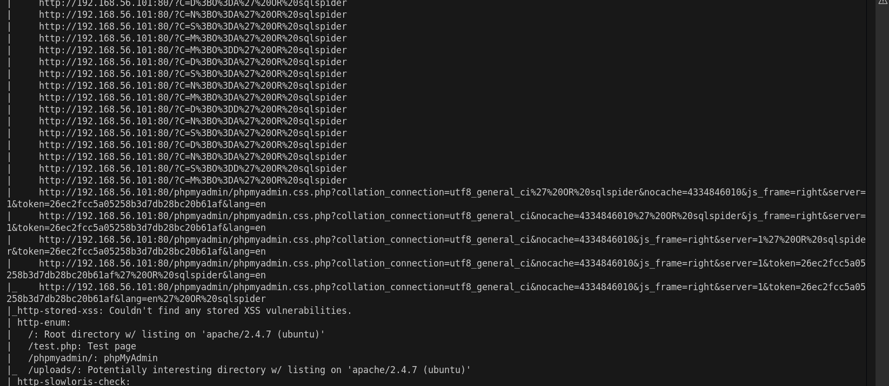

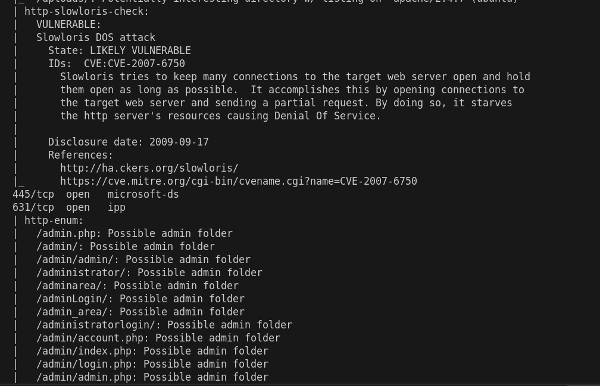

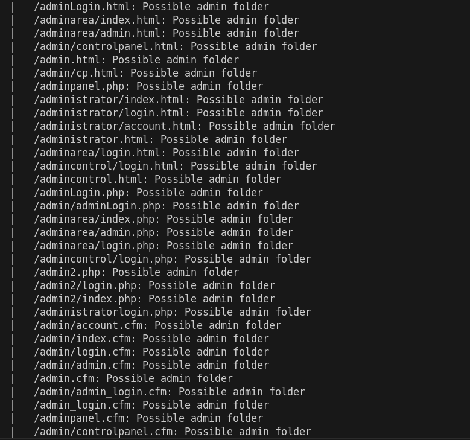

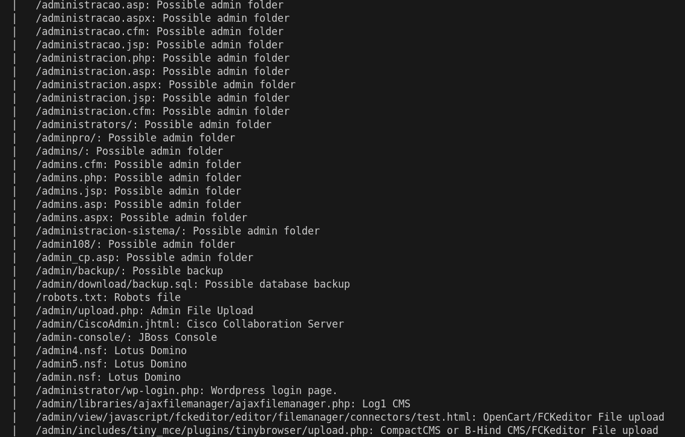

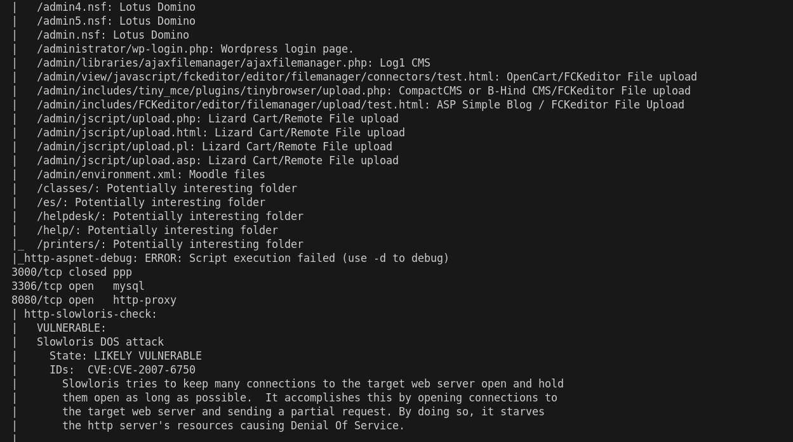

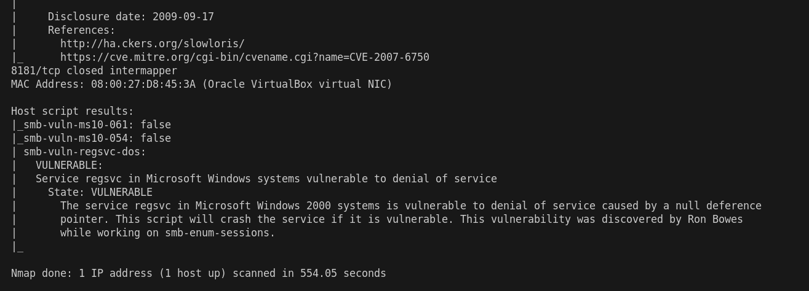

## Findings

The Nmap Scripting Engine (NSE) was used to perform advanced service enumeration and vulnerability identification on the target host. Two separate scans were conducted during this phase. The first used Nmap's default scripts (`-sC`) together with service version detection (`-sV`) to gather additional information about the discovered services. The second executed the `vuln` script category to identify potential security weaknesses and misconfigurations.

The scans confirmed the presence of multiple network services and identified several security-relevant findings, including exposed web directories, SMB security configuration issues, possible Cross-Site Request Forgery (CSRF) vulnerabilities, potential SQL injection entry points, and a likely susceptibility to the Slowloris Denial-of-Service attack (CVE-2007-6750). While several results indicate potential vulnerabilities, they require manual verification before being considered confirmed security issues.

| Port | Service | NSE Findings |
|------|---------|--------------|
| 22 | SSH | Retrieved RSA, DSA, ECDSA, and ED25519 host keys. |
| 80 | Apache HTTP | Directory listing enabled; exposed `/chat/`, `/drupal/`, `/phpmyadmin/`, `/uploads/`, and application files. |
| 80 | Apache HTTP | Possible CSRF vulnerabilities identified in several web application forms. |
| 80 | Apache HTTP | Potential SQL injection points detected and require manual validation. |
| 80 | Apache HTTP | Apache web server identified as likely vulnerable to the Slowloris Denial-of-Service attack (CVE-2007-6750). |
| 445 | SMB | Guest authentication detected; SMB message signing not required; additional SMB security checks completed. |
| 631 | CUPS | Administrative web interface discovered with potentially interesting administrative directories. |
| 8080 | Jetty | Jetty web server also identified as likely vulnerable to the Slowloris attack. |

## Technical Analysis

The Nmap Scripting Engine extends standard port scanning by executing specialized scripts against discovered services. These scripts automate common enumeration and security assessment tasks, including service interrogation, configuration analysis, authentication testing, web application discovery, and vulnerability detection.

The default NSE scripts successfully collected additional information regarding service configuration, exposed resources, authentication mechanisms, and supported protocols. The vulnerability scan further analyzed the identified services against a collection of known security checks, highlighting possible weaknesses that warrant additional manual investigation.

It is important to note that NSE vulnerability scripts are designed as reconnaissance tools. Some reported findings represent potential vulnerabilities based on observed behavior and should be manually validated before being classified as confirmed security issues.

## Security Assessment

The NSE scans identified several security concerns that could increase the attack surface of the target system.

Directory listing on the Apache web server exposes application directories and files that may assist attackers during reconnaissance. Multiple web forms were flagged as potentially vulnerable to Cross-Site Request Forgery attacks, while several application endpoints were identified as possible SQL injection candidates requiring manual verification.

The Apache and Jetty web servers were also reported as likely vulnerable to the Slowloris Denial-of-Service attack (CVE-2007-6750), which attempts to exhaust server resources by maintaining numerous incomplete HTTP connections.

SMB enumeration confirmed guest authentication and identified message signing as not required, weakening protection against certain network-based attacks. Although the SMB vulnerability scripts did not identify some historical Microsoft vulnerabilities, the overall configuration should still be reviewed to ensure compliance with current security best practices.

## Defensive Recommendations

- Disable unnecessary directory listing on web servers.
- Validate all user input using secure server-side validation techniques.
- Implement Cross-Site Request Forgery protections for all sensitive forms.
- Use parameterized queries and prepared statements to mitigate SQL injection.
- Configure web servers with appropriate connection limits and request timeouts to reduce the risk of Slowloris attacks.
- Restrict access to administrative interfaces and sensitive web applications.
- Enable SMB message signing and disable guest access where operationally feasible.
- Perform regular vulnerability assessments and promptly apply vendor security updates.

## Key Takeaway

NSE Script Scanning significantly enhanced the information gathered during previous scanning phases by identifying service configurations, exposed resources, authentication mechanisms, and potential security weaknesses. These findings provide valuable intelligence for prioritizing remediation efforts and planning subsequent penetration testing activities while emphasizing the importance of manual validation for reported vulnerabilities.

## Conclusion

The NSE Script Scanning phase successfully expanded the assessment beyond basic service identification by combining advanced service enumeration with automated vulnerability detection. The scans identified multiple security-relevant findings, including exposed application resources, SMB configuration weaknesses, potential web application vulnerabilities, and likely susceptibility to the Slowloris Denial-of-Service attack. Although several findings require manual verification, the results provide a strong technical foundation for vulnerability validation and risk-based remediation planning during subsequent stages of the penetration testing engagement.

---

# UDP Port Scanning

## Command Output Screenshot

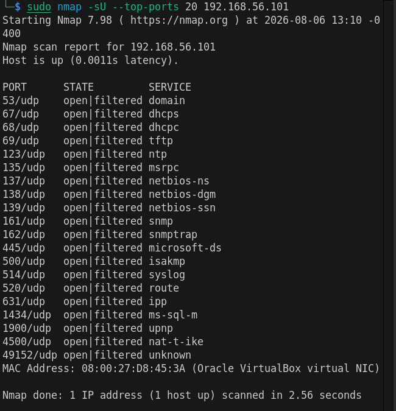

## Findings

A UDP scan was performed against the target using Nmap's `-sU` option together with the `--top-ports 20` parameter to examine the twenty most commonly used UDP ports. Unlike TCP, UDP is a connectionless protocol and does not establish a handshake before transmitting data. As a result, UDP scanning often identifies ports as **open|filtered** when no response is received, making definitive state determination more difficult.

The scan identified twenty UDP ports in the **open|filtered** state, including several commonly associated with infrastructure and network services.

| Port | Service | State |
|------|---------|-------|
| 53 | DNS | Open\|Filtered |
| 67 | DHCP Server | Open\|Filtered |
| 68 | DHCP Client | Open\|Filtered |
| 69 | TFTP | Open\|Filtered |
| 123 | NTP | Open\|Filtered |
| 135 | MSRPC | Open\|Filtered |
| 137 | NetBIOS Name Service | Open\|Filtered |
| 138 | NetBIOS Datagram Service | Open\|Filtered |
| 139 | NetBIOS Session Service | Open\|Filtered |
| 161 | SNMP | Open\|Filtered |
| 162 | SNMP Trap | Open\|Filtered |
| 445 | Microsoft-DS | Open\|Filtered |
| 500 | ISAKMP | Open\|Filtered |
| 514 | Syslog | Open\|Filtered |
| 520 | RIP | Open\|Filtered |
| 631 | IPP | Open\|Filtered |
| 1434 | Microsoft SQL Monitor | Open\|Filtered |
| 1900 | UPnP | Open\|Filtered |
| 4500 | NAT-T IKE | Open\|Filtered |
| 49152 | Unknown | Open\|Filtered |

## Technical Analysis

UDP scanning differs significantly from TCP scanning because UDP services generally do not acknowledge probe packets. When no response is received, Nmap classifies the port as **open|filtered**, indicating that the port may be open or that packet filtering is preventing a definitive determination.

The identified ports correspond to services commonly used for network infrastructure, name resolution, time synchronization, file transfer, network management, and device discovery. While these results do not confirm that every service is actively running, they identify UDP services that warrant additional investigation.

## Security Assessment

Several identified UDP services have historically been associated with security risks when improperly configured.

Services such as DNS, TFTP, SNMP, NetBIOS, UPnP, and Syslog may expose sensitive information or increase the attack surface if left accessible from untrusted networks. Because UDP lacks the connection-oriented behavior of TCP, additional enumeration techniques may be required to determine whether these services are actively responding.

The presence of multiple **open|filtered** UDP ports highlights the importance of reviewing firewall rules, service configurations, and network segmentation to minimize unnecessary exposure.

## Defensive Recommendations

- Disable unnecessary UDP services.
- Restrict UDP services using firewall rules and network segmentation.
- Secure SNMP using strong community strings or SNMPv3.
- Disable TFTP unless operationally required.
- Limit NetBIOS and UPnP exposure to trusted internal networks.
- Regularly review exposed UDP services during vulnerability assessments.

## Key Takeaway

UDP port scanning complements TCP reconnaissance by identifying additional network services that may not be visible during standard TCP scans. Although UDP results often require further validation, they provide valuable insight into the target's overall attack surface and assist in prioritizing subsequent security assessments.

## Conclusion

The UDP port scan successfully identified several commonly used UDP services in the **open|filtered** state, expanding the understanding of the target's exposed network surface. While the connectionless nature of UDP prevents definitive confirmation of many services, the findings highlight areas requiring further investigation and reinforce the importance of securing unnecessary UDP services through appropriate configuration and network controls.

---

# Web Enumeration

## Command Output Screenshots

### WhatWeb Technology Identification

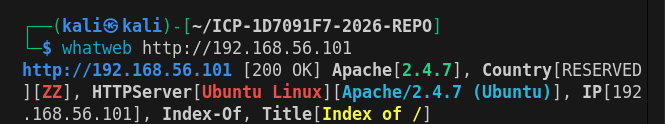

### Nikto Web Server Scan

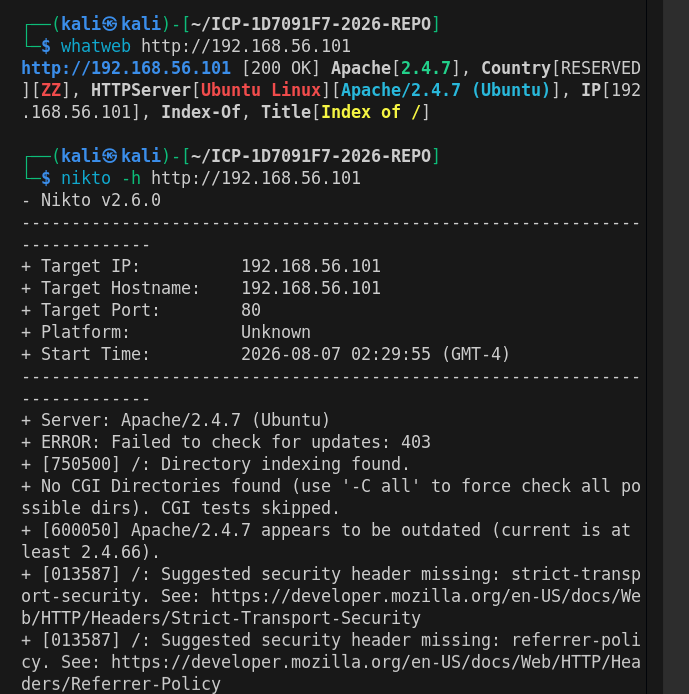

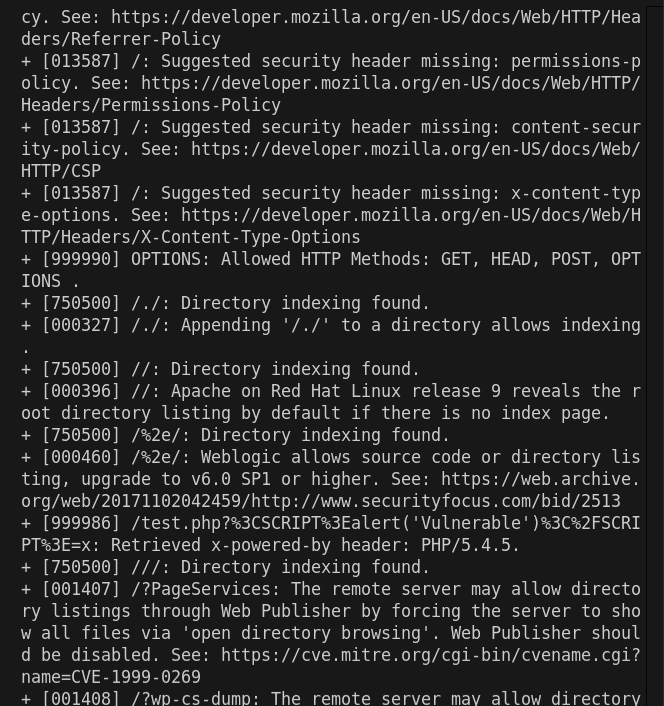


### Gobuster Directory Enumeration
 
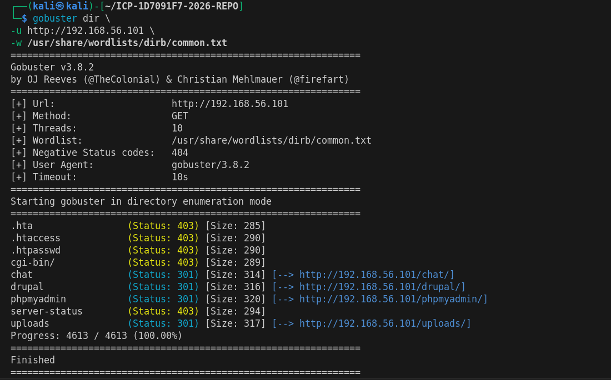

### Browser Verification

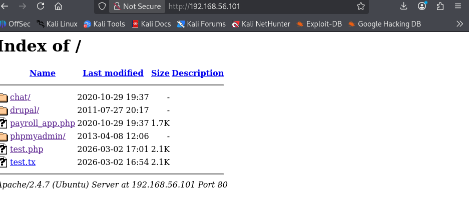

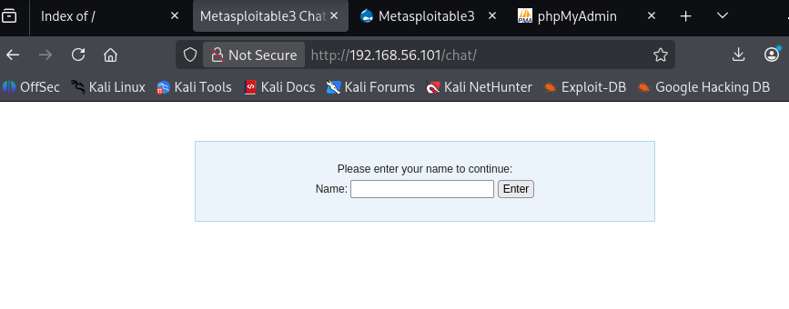

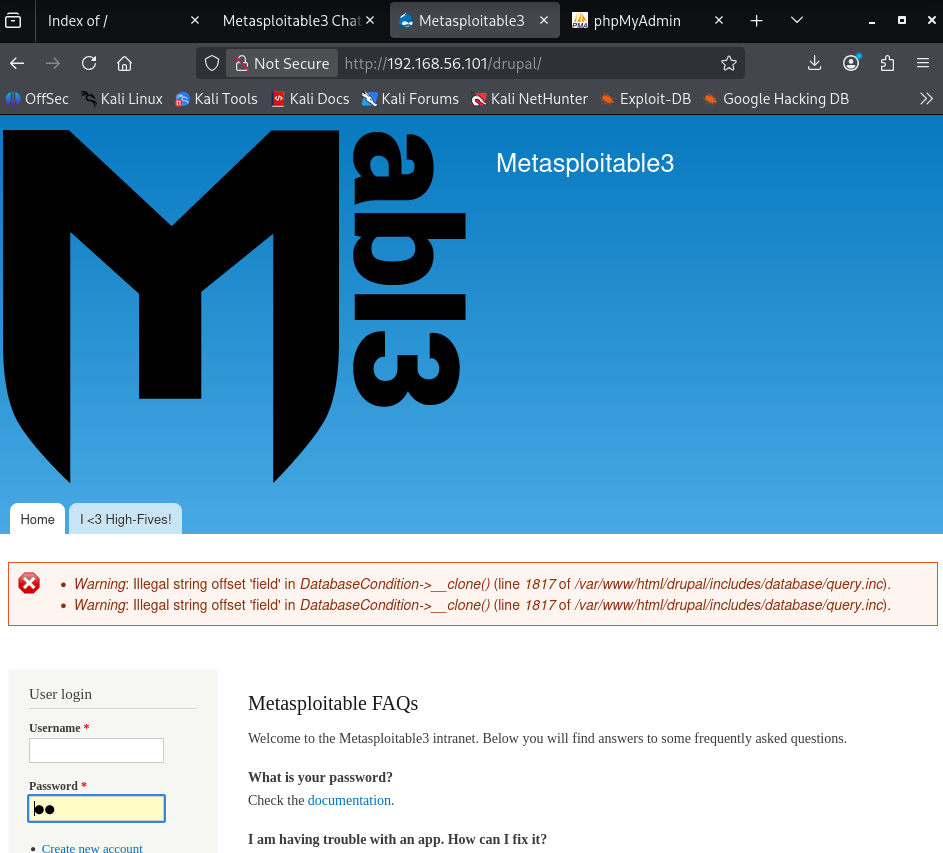

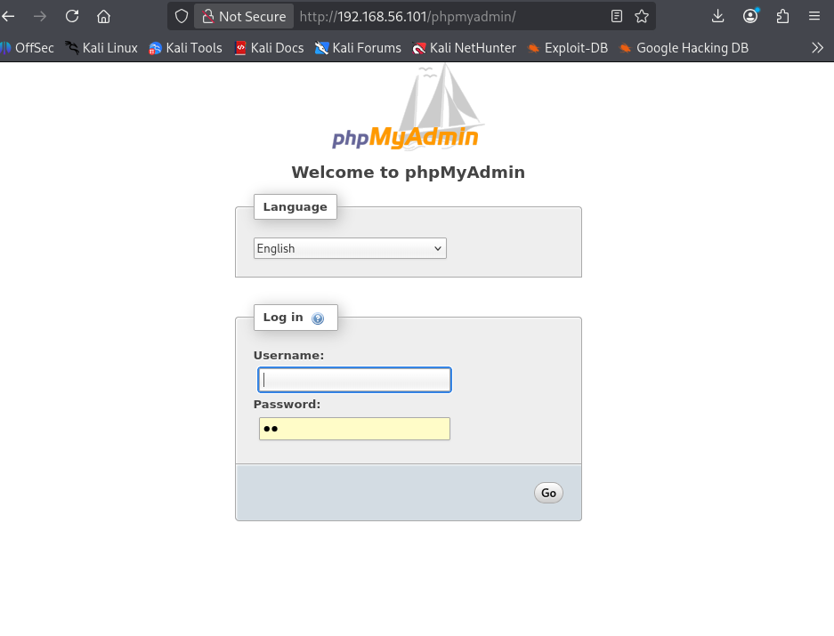

## Findings

Web enumeration was performed against the target's HTTP service to identify web technologies, exposed resources, hidden directories, administrative interfaces, and potential security weaknesses. Multiple enumeration tools, including WhatWeb, Nikto, Gobuster, and manual browser verification, were used to gather comprehensive information about the web server.

The enumeration identified an Apache 2.4.7 web server running on Ubuntu Linux with directory indexing enabled. Several publicly accessible applications and directories were discovered, including a chat application, a Drupal content management system, phpMyAdmin, and an uploads directory. Additional findings included outdated software versions, missing HTTP security headers, and exposed application resources requiring further security assessment.

## Web Enumeration Findings

| Finding | Description | Risk |
|---------|-------------|------|
| Apache Web Server | Apache HTTP Server 2.4.7 running on Ubuntu Linux | Medium |
| Directory Listing | Root directory indexing enabled | Medium |
| Chat Application | Publicly accessible `/chat/` directory | Medium |
| Drupal CMS | Drupal application identified | Medium |
| phpMyAdmin | Administrative database interface exposed | High |
| Uploads Directory | Public `/uploads/` directory discovered | Medium |
| Missing Security Headers | Multiple recommended HTTP security headers absent | Medium |
| Outdated Apache Version | Apache 2.4.7 identified as outdated | High |
| PHP Version Disclosure | PHP/5.4.5 disclosed through HTTP headers | Medium |

## Technical Analysis

Web enumeration expands the understanding of exposed web services by identifying application technologies, administrative interfaces, hidden resources, and security misconfigurations. Unlike basic service detection, web enumeration provides detailed information about the web application's attack surface and identifies components that may require additional testing during later phases of a penetration test.

The combination of WhatWeb, Nikto, Gobuster, and manual verification confirmed the presence of multiple web applications and administrative interfaces while identifying several configuration weaknesses that could increase the target's exposure to attack.

## Security Assessment

The web enumeration phase identified several security concerns that should be addressed:

- Directory indexing exposes application files and directory structures to unauthorized users.
- The Apache web server is outdated and should be updated to a supported version.
- Missing HTTP security headers reduce protection against common web-based attacks.
- Public access to phpMyAdmin increases the risk of unauthorized database access.
- Publicly accessible application directories increase the overall attack surface.
- The uploads directory should be reviewed to ensure file upload restrictions are properly enforced.

## Defensive Recommendations

- Disable directory indexing on the web server.
- Upgrade Apache to a currently supported version.
- Implement recommended HTTP security headers, including Content-Security-Policy, Strict-Transport-Security, Referrer-Policy, Permissions-Policy, and X-Content-Type-Options.
- Restrict access to phpMyAdmin using authentication and network-based access controls.
- Review publicly accessible directories and remove unnecessary resources.
- Validate and restrict file uploads within the uploads directory.
- Regularly perform web application vulnerability assessments and security updates.

## Key Takeaway

Web enumeration successfully identified the technologies, applications, and exposed resources hosted by the target web server. The results revealed multiple configuration weaknesses and administrative interfaces that warrant further investigation during subsequent vulnerability assessment and penetration testing activities.

## Conclusion

The web enumeration phase provided a detailed understanding of the target's web infrastructure and identified several areas requiring remediation, including directory indexing, outdated software, missing security headers, and exposed administrative interfaces. These findings establish a solid foundation for targeted vulnerability assessment and exploitation testing during the remaining stages of the penetration testing engagement.

---

# SMB Enumeration

*To be completed.*

---

# SMB Enumeration

*To be completed.*

---

# FTP Enumeration

*To be completed.*

---

# SSH Enumeration

*To be completed.*

---

# Vulnerability Assessment

*To be completed.*

---

# Findings Summary

*To be completed.*

---

# Recommendations

*To be completed.*

---

# Conclusion

*To be completed.*

---

# References

- Nmap Official Documentation
- Kali Linux Documentation
- Metasploitable3 Documentation

---

# Appendix

Additional screenshots, raw scan outputs, and supporting evidence are stored in the `screenshots/`, `scans/`, and `docs/` directories.