# Week 2 – Network Scanning & Enumeration

## Professional Network Assessment Report

## Project Overview

This project demonstrates a comprehensive network scanning and enumeration assessment conducted against a Metasploitable3 virtual machine using Kali Linux. The objective was to identify live hosts, discover open ports, enumerate running services, identify the target operating system, and collect information that could support a penetration testing engagement.

All testing was performed in a controlled lab environment with authorization. Industry-standard tools such as Nmap and the Nmap Scripting Engine (NSE) were used to perform reconnaissance and service enumeration while documenting the findings in a professional report.

## Introduction

Network reconnaissance is a critical phase of penetration testing and security assessments, as it enables security professionals to identify active hosts, discover open ports, determine running services, and gather information about target systems before conducting further analysis. One of the most widely used tools for this purpose is Nmap (Network Mapper), an open-source network scanning utility capable of performing a variety of host discovery and port scanning techniques.

This assessment was conducted against a Metasploitable3 virtual machine within an isolated lab environment for educational purposes. All activities were performed with proper authorization.

## Objectives

- Verify target host availability.
- Discover open TCP and UDP ports.
- Identify running services and software versions.
- Perform operating system fingerprinting.
- Enumerate services using Nmap NSE scripts.
- Assess potential vulnerabilities.
- Document findings in a professional technical report.

## Lab Environment

| Component | Details |
|-----------|---------|
| Attacker Machine | Kali Linux |
| Target Machine | Metasploitable3 |
| Virtualization Platform | Oracle VirtualBox |
| Network Configuration | Host-Only Network |
| Primary Tool | Nmap 7.98 |
| Assessment Type | Authorized Lab Assessment |

## Table of Contents

- [Executive Summary](#executive-summary)
- [Engagement Overview](#engagement-overview)
- [Assessment Methodology](#assessment-methodology)
- [Lab Environment](#lab-environment)
- [Reconnaissance and Host Discovery](#reconnaissance-and-host-discovery)
- [TCP Port Scanning](#tcp-port-scanning)
- [Service Enumeration](#service-enumeration)
- [Operating System Detection](#operating-system-detection)
- [NSE Script Scanning](#nse-script-scanning)
- [UDP Port Scanning](#udp-port-scanning)
- [Web Enumeration](#web-enumeration)
- [SMB Enumeration](#smb-enumeration)
- [FTP Enumeration](#ftp-enumeration)
- [SSH Enumeration](#ssh-enumeration)
- [Vulnerability Assessment](#vulnerability-assessment)
- [Findings Summary](#findings-summary)
- [Recommendations](#recommendations)
- [Conclusion](#conclusion)
- [References](#references)
- [Appendix](#appendix)

---

# Executive Summary

*To be completed as the assessment progresses.*

---

# Engagement Overview

*To be completed.*

---

# Assessment Methodology

The assessment followed a structured reconnaissance methodology using Nmap to identify active hosts, discover open ports, identify running services, perform operating system detection, and enumerate available network services.

---

# Reconnaissance and Host Discovery

The first phase of the assessment was to determine whether the target host was online and reachable. Nmap host discovery confirmed that the Metasploitable3 virtual machine was active on the network.

## Host Discovery Overview


## Command Used

```bash
nmap -sn 192.168.56.101
```

## Scan Output Screenshot


## Findings

- Host successfully responded to ICMP requests.
- Target was confirmed online.
- MAC address identified as Oracle VirtualBox virtual NIC.
- Ready for further enumeration.

---

# TCP Port Scanning

## Overview

Following successful host discovery, a TCP SYN scan was performed to identify open TCP ports on the target system. The TCP SYN scan, commonly referred to as a half-open scan, is one of Nmap's most efficient reconnaissance techniques for discovering active network services. Instead of completing the full TCP three-way handshake, the scanner sends a SYN packet and analyzes the target's response to determine whether a port is open, closed, or filtered.

This scanning technique enables security professionals to rapidly enumerate exposed services while generating minimal network traffic. The results obtained during this phase establish the foundation for subsequent service enumeration, operating system fingerprinting, and vulnerability assessment activities.

## TCP SYN Scan Overview


## Command Used

```bash
sudo nmap -sS -p 1-1000 192.168.56.101
```

## Command Output Screenshot


## Findings

The TCP SYN scan successfully identified five open TCP ports on the target system within the first 1,000 TCP ports scanned. These ports indicate active services that are accessible over the network and warrant further enumeration.

| Port | State | Service |
|------|-------|---------|
| 21 | Open | FTP |
| 22 | Open | SSH |
| 80 | Open | HTTP |
| 445 | Open | Microsoft-DS (SMB) |
| 631 | Open | Internet Printing Protocol (IPP) |

Additionally, Nmap reported that 995 TCP ports were filtered (no response), indicating that probe packets did not receive a reply from the target. The target host responded with a low latency of approximately 1.4 ms, confirming reliable connectivity within the isolated laboratory environment.


---

## Technical Analysis

The TCP SYN scan utilized Nmap's half-open scanning technique to identify the state of TCP ports without completing the full TCP three-way handshake. During the scan, Nmap transmitted TCP SYN packets to the target system and analyzed the responses to determine the state of each port.

An open port responded with a SYN/ACK packet, indicating that a service was actively listening for incoming connections. Nmap then immediately terminated the connection by sending a Reset (RST) packet, preventing the handshake from completing. Closed ports responded with an RST packet, while filtered ports either failed to respond or were blocked by network filtering devices such as firewalls or packet filtering rules.

The scan completed in approximately 5.97 seconds and identified five accessible TCP services on the target host. These services provide the foundation for subsequent service version detection, operating system fingerprinting, vulnerability assessment, and service-specific enumeration during the later phases of the engagement.

## Security Assessment

The TCP SYN scan revealed multiple network services exposed on the target system, including FTP, SSH, HTTP, SMB, and IPP. Each exposed service represents a potential entry point that could be exploited if vulnerabilities, weak configurations, or outdated software are present.

The presence of FTP may expose risks associated with insecure authentication or anonymous access if not properly configured. SSH is generally considered secure but may be susceptible to brute-force attacks or weak credential policies. The HTTP service may expose web application vulnerabilities, while SMB has historically been associated with several high-impact vulnerabilities when left unpatched or misconfigured. The Internet Printing Protocol (IPP) should also be reviewed to ensure it is necessary and securely configured.

Although a TCP SYN scan does not directly identify vulnerabilities, it provides a comprehensive inventory of exposed services that should be prioritized for further enumeration, version detection, and targeted security testing during the subsequent phases of the assessment.

## Defensive Recommendations

To reduce the attack surface identified during the TCP SYN scan, the following security measures are recommended:

* Disable or remove unnecessary network services that are not required for business operations.
* Restrict access to critical services such as SSH and SMB using firewall rules, network segmentation, or access control lists (ACLs).
* Regularly apply security patches and software updates to all exposed services.
* Replace insecure protocols with secure alternatives where appropriate and enforce strong authentication mechanisms.
* Monitor network traffic for unauthorized scanning activity using intrusion detection or intrusion prevention systems (IDS/IPS).
* Conduct routine network vulnerability assessments and penetration tests to identify newly exposed services and validate existing security controls.

## Key Takeaway

The TCP SYN scan efficiently identified the target's exposed TCP services while minimizing network traffic through the use of the half-open scanning technique. The results established a reliable inventory of accessible network services, providing the necessary foundation for service enumeration, operating system detection, and vulnerability assessment during the subsequent phases of the penetration testing engagement.

## Conclusion

The TCP SYN scan successfully identified five open TCP ports and confirmed the availability of several network services on the target system. The information gathered during this phase established the target's network exposure and provided a structured basis for deeper service enumeration and security analysis. The next phase of the assessment will focus on identifying service versions and software banners to determine potential vulnerabilities associated with each exposed service.

# Service Version Detection

## Overview

Following the identification of open TCP ports, a service version detection scan was performed to determine the applications and software versions running on each exposed service. Nmap's service detection engine probes open ports using protocol-specific requests and analyzes the responses to accurately identify running services, software versions, and supported protocols.

This information enables security professionals to identify outdated software, correlate versions with publicly disclosed vulnerabilities (CVEs), and prioritize systems requiring remediation or further investigation during a penetration testing engagement.

## Service Version Detection Overview


## Command Used

```bash
sudo nmap -sV -T4 192.168.56.101
```
## Command Output Screenshot


## Findings

The service version detection scan successfully identified the software and version information associated with the exposed network services on the target system. In addition to confirming the previously discovered open ports, the scan revealed specific applications, service banners, and operating system information that support further vulnerability assessment.

| Port | Service | Version |
|------|---------|---------|
| 21 | FTP | ProFTPD 1.3.5 |
| 22 | SSH | OpenSSH 6.6.1p1 Ubuntu 2ubuntu2.13 |
| 80 | HTTP | Apache httpd 2.4.7 (Ubuntu) |
| 445 | SMB | Samba smbd 3.X–4.X |
| 631 | IPP | CUPS 1.7 |
| 3306 | MySQL | MySQL (unauthorized) |
| 8080 | HTTP | Jetty 8.1.7.v20120910 |

The scan also identified two closed ports (3000 and 8181), confirmed the target hostname as **METASPLOITABLE3-UB1404**, and identified the operating system as a Unix/Linux-based host. The scan completed in approximately **12.85 seconds**.

---

## Technical Analysis

Nmap's service version detection (`-sV`) performs active fingerprinting by sending protocol-specific probes to each discovered open port and analyzing the responses. The collected banners are compared against Nmap's service fingerprint database to accurately identify applications, software versions, and supported protocols.

The scan successfully identified several commonly deployed services, including ProFTPD, OpenSSH, Apache HTTP Server, Samba, CUPS, MySQL, and Jetty. This information provides a detailed inventory of the software running on the target system and establishes the foundation for vulnerability research by correlating identified versions with publicly disclosed Common Vulnerabilities and Exposures (CVEs).

---

## Security Assessment

The service version detection scan identified multiple applications and software versions that should be evaluated against publicly disclosed vulnerabilities and vendor security advisories. Services such as ProFTPD, Apache HTTP Server, Samba, Jetty, and CUPS have historically been associated with security vulnerabilities when running outdated or unsupported versions.

The MySQL service responded with an **"unauthorized"** message, confirming that the database service is reachable over the network. Although authentication prevented access during this phase, unnecessary exposure of database services increases the attack surface and should be carefully reviewed.

The operating system fingerprint also confirmed that the target is a Linux-based host, providing valuable context for subsequent enumeration and vulnerability assessment. While the version detection scan does not directly identify exploitable vulnerabilities, it supplies the critical information required to prioritize further testing.

---

## Defensive Recommendations

- Regularly update exposed services to supported versions with the latest security patches.
- Disable or remove services that are not required for operational purposes.
- Restrict access to SSH, MySQL, and SMB using firewall rules or network segmentation.
- Limit exposure of web applications and administrative interfaces to trusted networks.
- Perform regular vulnerability assessments to identify outdated software.
- Continuously monitor exposed services for configuration changes and suspicious activity.

---

## Key Takeaway

Service version detection provides a detailed inventory of the software running on exposed network services. This information enables security professionals to correlate identified versions with known vulnerabilities, prioritize remediation efforts, and focus subsequent penetration testing activities on the systems presenting the highest potential risk.

---

## Conclusion

The service version detection scan successfully identified the applications, software versions, and operating system information associated with the target's exposed services. These findings provide the technical foundation required for vulnerability assessment, service-specific enumeration, and informed security decision-making during the remaining phases of the penetration testing engagement.


# Service Enumeration

## Command Output Screenshot


## Findings

The service enumeration phase was performed to gather additional information about the services identified during the service version detection scan. Nmap default NSE scripts (`-sC`) were used together with service version detection (`-sV`) to identify service configurations, exposed resources, and potential security weaknesses.

| Port | Service | Enumeration Findings |
|------|---------|---------------------|
| 21 | FTP | ProFTPD 1.3.5 was identified. No anonymous FTP access information was disclosed during enumeration. |
| 22 | SSH | SSH host keys were successfully retrieved, including RSA, DSA, ECDSA, and ED25519 keys. |
| 80 | HTTP | Directory listing was enabled, exposing directories including `/chat/`, `/drupal/`, `/phpmyadmin/`, and files such as `payroll_app.php`. |
| 445 | SMB | Samba 4.3.11 identified. Guest authentication was detected and SMB message signing was disabled. |
| 631 | CUPS | CUPS 1.7.2 web interface identified. Potentially risky HTTP PUT method detected. |
| 3306 | MySQL | MySQL service was reachable, but authentication was required. |
| 8080 | HTTP | Jetty 8.1.7.v20120910 identified. Server returned HTTP 404 response. |

## Technical Analysis

Service enumeration provides deeper visibility into the configuration and behavior of exposed network services. While service version detection identifies running software, enumeration attempts to discover additional information such as authentication mechanisms, available resources, and security settings.

The scan revealed several important findings, including exposed web directories, SMB security configuration weaknesses, and accessible network services requiring further security assessment.

## Security Assessment

The enumeration results identified multiple security concerns:

- Web directory listing exposes additional files and application paths that may contain sensitive information.
- SMB guest access and disabled message signing increase the potential for unauthorized access and relay attacks.
- Exposed administrative applications such as phpMyAdmin should be restricted.
- Outdated services require vulnerability assessment and patch management.

## Defensive Recommendations

- Disable directory listing on web servers.
- Restrict access to administrative web applications.
- Enable SMB message signing where possible.
- Disable unnecessary guest access.
- Remove or update outdated services.
- Apply security patches regularly.
- Limit exposure of database services to trusted networks only.

## Key Takeaway

Service enumeration provides valuable intelligence about exposed services, configurations, and potential weaknesses. The collected information assists security professionals in prioritizing vulnerability assessments and planning further penetration testing activities.

## Conclusion

The service enumeration phase successfully expanded the understanding of the target system's exposed services. The findings revealed important security issues including web directory exposure, SMB configuration weaknesses, and potentially vulnerable service configurations. These results provide the foundation for further vulnerability analysis and exploitation testing.

---

# Operating System Detection

## Command Output Screenshot


## Findings

The operating system detection scan was performed using Nmap's OS fingerprinting capability (`-O`) to identify the underlying operating system and system characteristics of the target host.

The scan confirmed that the target system was active and running multiple exposed services, including FTP, SSH, HTTP, SMB, IPP, MySQL, and an additional HTTP service. Nmap was unable to determine an exact operating system match; however, it identified several high-confidence Linux kernel fingerprints.

| Category | Result |
|----------|--------|
| Operating System Family | Linux |
| Best OS Guess | Linux 3.2 - 4.14 |
| Confidence Level | 98% |
| Network Distance | 1 hop |
| Exact OS Match | Not identified |

## Technical Analysis

Nmap OS detection works by analyzing TCP/IP stack characteristics, including packet responses, TCP window sizes, IP identification patterns, and protocol behavior. These fingerprints are compared against Nmap's operating system database to estimate the target platform.

The scan produced multiple Linux-based fingerprints with the highest confidence indicating a Linux kernel version range between 3.2 and 4.14. The inability to obtain an exact match is likely due to virtualization characteristics and differences between the target system configuration and Nmap's fingerprint database.

## Security Assessment

Identifying the operating system provides important context for vulnerability analysis and helps determine relevant attack paths. The Linux identification confirms that future testing should focus on Linux-specific vulnerabilities, service configurations, and privilege escalation opportunities.

The exposed services identified during OS detection, including SSH, SMB, HTTP, and database services, should be reviewed for outdated software versions and insecure configurations.

## Defensive Recommendations

- Keep the operating system updated with current security patches.
- Remove unnecessary exposed services.
- Apply secure configuration standards to network services.
- Monitor Linux hosts for unauthorized changes.
- Regularly perform vulnerability assessments.

## Key Takeaway

OS detection provides valuable information about the underlying platform hosting exposed services. Although an exact operating system match was not obtained, the scan successfully identified the target as a Linux-based system, supporting further vulnerability assessment activities.

## Conclusion

The operating system detection scan successfully identified the target host as a Linux-based system with high-confidence kernel fingerprint matches. This information provides additional context for vulnerability research and supports the selection of appropriate penetration testing techniques.

---

# NSE Script Scanning

## Command Output Screenshots

### Default NSE Scripts (`-sC -sV`)


### Vulnerability NSE Scripts (`--script vuln`)


## Findings

The Nmap Scripting Engine (NSE) was used to perform advanced service enumeration and vulnerability identification on the target host. Two separate scans were conducted during this phase. The first used Nmap's default scripts (`-sC`) together with service version detection (`-sV`) to gather additional information about the discovered services. The second executed the `vuln` script category to identify potential security weaknesses and misconfigurations.

The scans confirmed the presence of multiple network services and identified several security-relevant findings, including exposed web directories, SMB security configuration issues, possible Cross-Site Request Forgery (CSRF) vulnerabilities, potential SQL injection entry points, and a likely susceptibility to the Slowloris Denial-of-Service attack (CVE-2007-6750). While several results indicate potential vulnerabilities, they require manual verification before being considered confirmed security issues.

| Port | Service | NSE Findings |
|------|---------|--------------|
| 22 | SSH | Retrieved RSA, DSA, ECDSA, and ED25519 host keys. |
| 80 | Apache HTTP | Directory listing enabled; exposed `/chat/`, `/drupal/`, `/phpmyadmin/`, `/uploads/`, and application files. |
| 80 | Apache HTTP | Possible CSRF vulnerabilities identified in several web application forms. |
| 80 | Apache HTTP | Potential SQL injection points detected and require manual validation. |
| 80 | Apache HTTP | Apache web server identified as likely vulnerable to the Slowloris Denial-of-Service attack (CVE-2007-6750). |
| 445 | SMB | Guest authentication detected; SMB message signing not required; additional SMB security checks completed. |
| 631 | CUPS | Administrative web interface discovered with potentially interesting administrative directories. |
| 8080 | Jetty | Jetty web server also identified as likely vulnerable to the Slowloris attack. |

## Technical Analysis

The Nmap Scripting Engine extends standard port scanning by executing specialized scripts against discovered services. These scripts automate common enumeration and security assessment tasks, including service interrogation, configuration analysis, authentication testing, web application discovery, and vulnerability detection.

The default NSE scripts successfully collected additional information regarding service configuration, exposed resources, authentication mechanisms, and supported protocols. The vulnerability scan further analyzed the identified services against a collection of known security checks, highlighting possible weaknesses that warrant additional manual investigation.

It is important to note that NSE vulnerability scripts are designed as reconnaissance tools. Some reported findings represent potential vulnerabilities based on observed behavior and should be manually validated before being classified as confirmed security issues.

## Security Assessment

The NSE scans identified several security concerns that could increase the attack surface of the target system.

Directory listing on the Apache web server exposes application directories and files that may assist attackers during reconnaissance. Multiple web forms were flagged as potentially vulnerable to Cross-Site Request Forgery attacks, while several application endpoints were identified as possible SQL injection candidates requiring manual verification.

The Apache and Jetty web servers were also reported as likely vulnerable to the Slowloris Denial-of-Service attack (CVE-2007-6750), which attempts to exhaust server resources by maintaining numerous incomplete HTTP connections.

SMB enumeration confirmed guest authentication and identified message signing as not required, weakening protection against certain network-based attacks. Although the SMB vulnerability scripts did not identify some historical Microsoft vulnerabilities, the overall configuration should still be reviewed to ensure compliance with current security best practices.

## Defensive Recommendations

- Disable unnecessary directory listing on web servers.
- Validate all user input using secure server-side validation techniques.
- Implement Cross-Site Request Forgery protections for all sensitive forms.
- Use parameterized queries and prepared statements to mitigate SQL injection.
- Configure web servers with appropriate connection limits and request timeouts to reduce the risk of Slowloris attacks.
- Restrict access to administrative interfaces and sensitive web applications.
- Enable SMB message signing and disable guest access where operationally feasible.
- Perform regular vulnerability assessments and promptly apply vendor security updates.

## Key Takeaway

NSE Script Scanning significantly enhanced the information gathered during previous scanning phases by identifying service configurations, exposed resources, authentication mechanisms, and potential security weaknesses. These findings provide valuable intelligence for prioritizing remediation efforts and planning subsequent penetration testing activities while emphasizing the importance of manual validation for reported vulnerabilities.

## Conclusion

The NSE Script Scanning phase successfully expanded the assessment beyond basic service identification by combining advanced service enumeration with automated vulnerability detection. The scans identified multiple security-relevant findings, including exposed application resources, SMB configuration weaknesses, potential web application vulnerabilities, and likely susceptibility to the Slowloris Denial-of-Service attack. Although several findings require manual verification, the results provide a strong technical foundation for vulnerability validation and risk-based remediation planning during subsequent stages of the penetration testing engagement.

---

# UDP Port Scanning

## Command Output Screenshot


## Findings

A UDP scan was performed against the target using Nmap's `-sU` option together with the `--top-ports 20` parameter to examine the twenty most commonly used UDP ports. Unlike TCP, UDP is a connectionless protocol and does not establish a handshake before transmitting data. As a result, UDP scanning often identifies ports as **open|filtered** when no response is received, making definitive state determination more difficult.

The scan identified twenty UDP ports in the **open|filtered** state, including several commonly associated with infrastructure and network services.

| Port | Service | State |
|------|---------|-------|
| 53 | DNS | Open\|Filtered |
| 67 | DHCP Server | Open\|Filtered |
| 68 | DHCP Client | Open\|Filtered |
| 69 | TFTP | Open\|Filtered |
| 123 | NTP | Open\|Filtered |
| 135 | MSRPC | Open\|Filtered |
| 137 | NetBIOS Name Service | Open\|Filtered |
| 138 | NetBIOS Datagram Service | Open\|Filtered |
| 139 | NetBIOS Session Service | Open\|Filtered |
| 161 | SNMP | Open\|Filtered |
| 162 | SNMP Trap | Open\|Filtered |
| 445 | Microsoft-DS | Open\|Filtered |
| 500 | ISAKMP | Open\|Filtered |
| 514 | Syslog | Open\|Filtered |
| 520 | RIP | Open\|Filtered |
| 631 | IPP | Open\|Filtered |
| 1434 | Microsoft SQL Monitor | Open\|Filtered |
| 1900 | UPnP | Open\|Filtered |
| 4500 | NAT-T IKE | Open\|Filtered |
| 49152 | Unknown | Open\|Filtered |

## Technical Analysis

UDP scanning differs significantly from TCP scanning because UDP services generally do not acknowledge probe packets. When no response is received, Nmap classifies the port as **open|filtered**, indicating that the port may be open or that packet filtering is preventing a definitive determination.

The identified ports correspond to services commonly used for network infrastructure, name resolution, time synchronization, file transfer, network management, and device discovery. While these results do not confirm that every service is actively running, they identify UDP services that warrant additional investigation.

## Security Assessment

Several identified UDP services have historically been associated with security risks when improperly configured.

Services such as DNS, TFTP, SNMP, NetBIOS, UPnP, and Syslog may expose sensitive information or increase the attack surface if left accessible from untrusted networks. Because UDP lacks the connection-oriented behavior of TCP, additional enumeration techniques may be required to determine whether these services are actively responding.

The presence of multiple **open|filtered** UDP ports highlights the importance of reviewing firewall rules, service configurations, and network segmentation to minimize unnecessary exposure.

## Defensive Recommendations

- Disable unnecessary UDP services.
- Restrict UDP services using firewall rules and network segmentation.
- Secure SNMP using strong community strings or SNMPv3.
- Disable TFTP unless operationally required.
- Limit NetBIOS and UPnP exposure to trusted internal networks.
- Regularly review exposed UDP services during vulnerability assessments.

## Key Takeaway

UDP port scanning complements TCP reconnaissance by identifying additional network services that may not be visible during standard TCP scans. Although UDP results often require further validation, they provide valuable insight into the target's overall attack surface and assist in prioritizing subsequent security assessments.

## Conclusion

The UDP port scan successfully identified several commonly used UDP services in the **open|filtered** state, expanding the understanding of the target's exposed network surface. While the connectionless nature of UDP prevents definitive confirmation of many services, the findings highlight areas requiring further investigation and reinforce the importance of securing unnecessary UDP services through appropriate configuration and network controls.

---

# Web Enumeration

## Command Output Screenshots

### WhatWeb Technology Identification


### Nikto Web Server Scan


### Gobuster Directory Enumeration
 


### Browser Verification


## Findings

Web enumeration was performed against the target's HTTP service to identify web technologies, exposed resources, hidden directories, administrative interfaces, and potential security weaknesses. Multiple enumeration tools, including WhatWeb, Nikto, Gobuster, and manual browser verification, were used to gather comprehensive information about the web server.

The enumeration identified an Apache 2.4.7 web server running on Ubuntu Linux with directory indexing enabled. Several publicly accessible applications and directories were discovered, including a chat application, a Drupal content management system, phpMyAdmin, and an uploads directory. Additional findings included outdated software versions, missing HTTP security headers, and exposed application resources requiring further security assessment.

## Web Enumeration Findings

| Finding | Description | Risk |
|---------|-------------|------|
| Apache Web Server | Apache HTTP Server 2.4.7 running on Ubuntu Linux | Medium |
| Directory Listing | Root directory indexing enabled | Medium |
| Chat Application | Publicly accessible `/chat/` directory | Medium |
| Drupal CMS | Drupal application identified | Medium |
| phpMyAdmin | Administrative database interface exposed | High |
| Uploads Directory | Public `/uploads/` directory discovered | Medium |
| Missing Security Headers | Multiple recommended HTTP security headers absent | Medium |
| Outdated Apache Version | Apache 2.4.7 identified as outdated | High |
| PHP Version Disclosure | PHP/5.4.5 disclosed through HTTP headers | Medium |

## Technical Analysis

Web enumeration expands the understanding of exposed web services by identifying application technologies, administrative interfaces, hidden resources, and security misconfigurations. Unlike basic service detection, web enumeration provides detailed information about the web application's attack surface and identifies components that may require additional testing during later phases of a penetration test.

The combination of WhatWeb, Nikto, Gobuster, and manual verification confirmed the presence of multiple web applications and administrative interfaces while identifying several configuration weaknesses that could increase the target's exposure to attack.

## Security Assessment

The web enumeration phase identified several security concerns that should be addressed:

- Directory indexing exposes application files and directory structures to unauthorized users.
- The Apache web server is outdated and should be updated to a supported version.
- Missing HTTP security headers reduce protection against common web-based attacks.
- Public access to phpMyAdmin increases the risk of unauthorized database access.
- Publicly accessible application directories increase the overall attack surface.
- The uploads directory should be reviewed to ensure file upload restrictions are properly enforced.

## Defensive Recommendations

- Disable directory indexing on the web server.
- Upgrade Apache to a currently supported version.
- Implement recommended HTTP security headers, including Content-Security-Policy, Strict-Transport-Security, Referrer-Policy, Permissions-Policy, and X-Content-Type-Options.
- Restrict access to phpMyAdmin using authentication and network-based access controls.
- Review publicly accessible directories and remove unnecessary resources.
- Validate and restrict file uploads within the uploads directory.
- Regularly perform web application vulnerability assessments and security updates.

## Key Takeaway

Web enumeration successfully identified the technologies, applications, and exposed resources hosted by the target web server. The results revealed multiple configuration weaknesses and administrative interfaces that warrant further investigation during subsequent vulnerability assessment and penetration testing activities.

## Conclusion

The web enumeration phase provided a detailed understanding of the target's web infrastructure and identified several areas requiring remediation, including directory indexing, outdated software, missing security headers, and exposed administrative interfaces. These findings establish a solid foundation for targeted vulnerability assessment and exploitation testing during the remaining stages of the penetration testing engagement.

---

---

# SMB Enumeration

## Command Output Screenshots

### Enum4linux SMB Enumeration

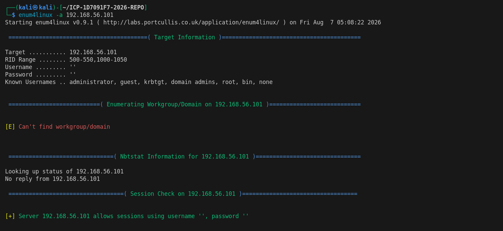

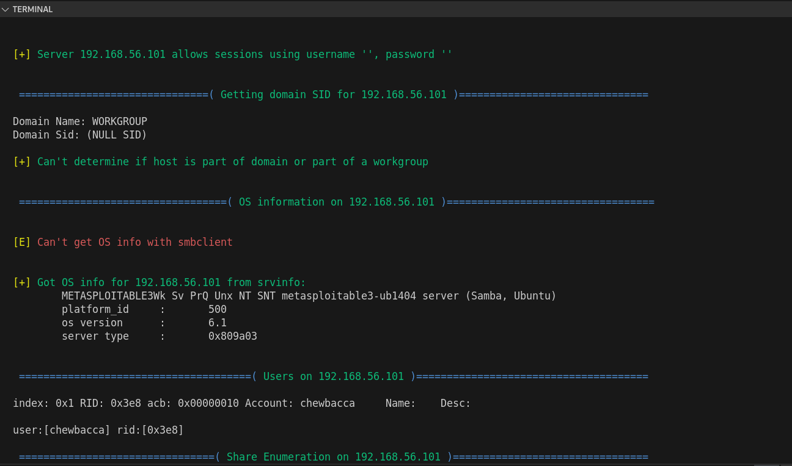

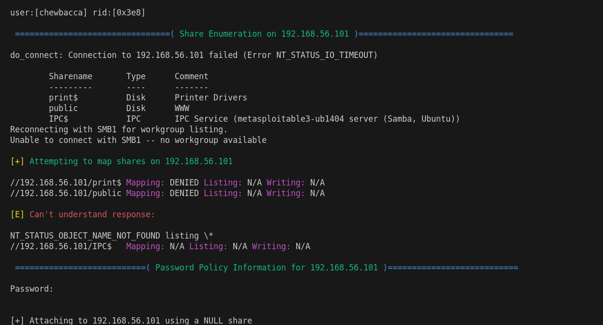

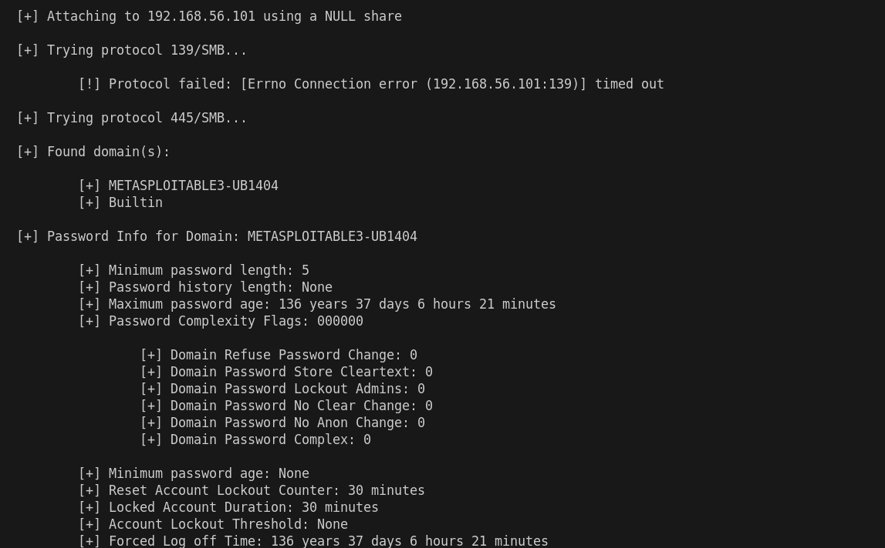

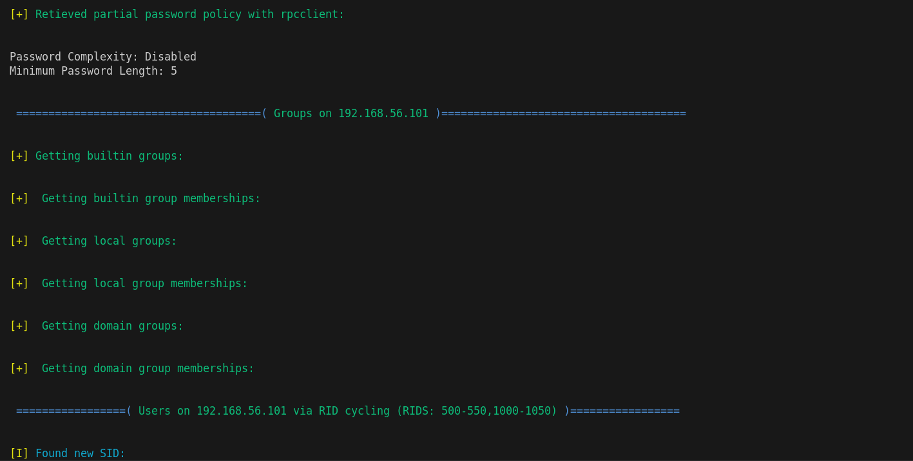

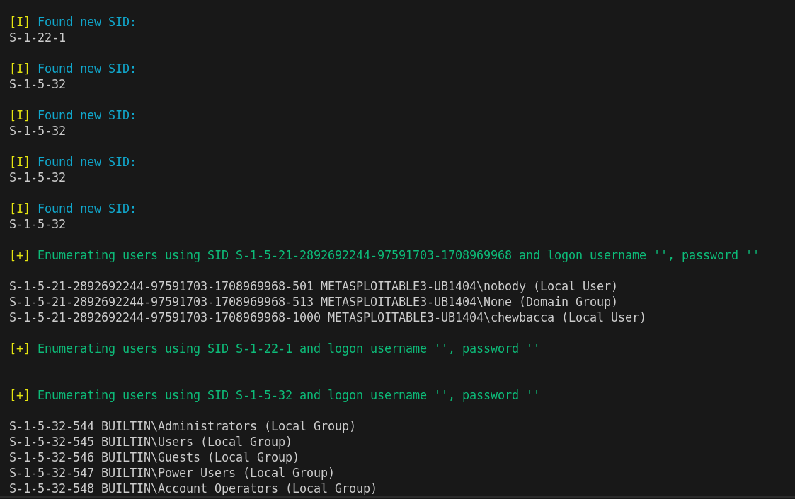

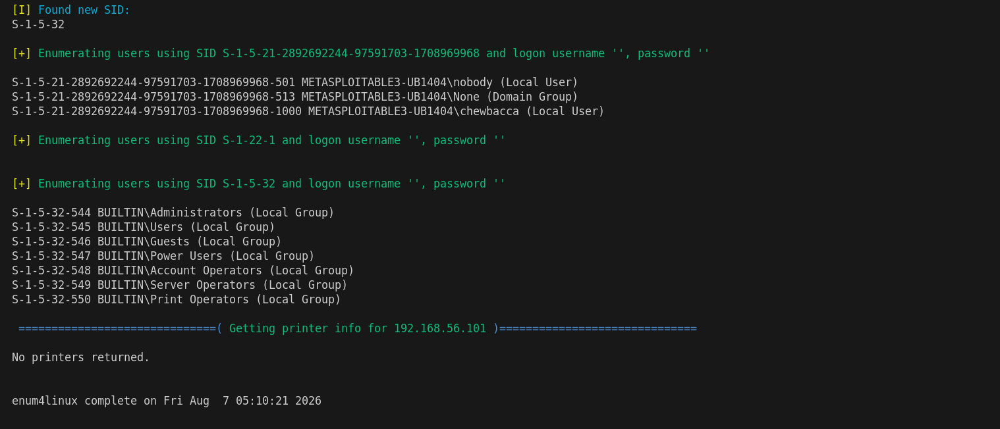


### SMB Share Enumeration

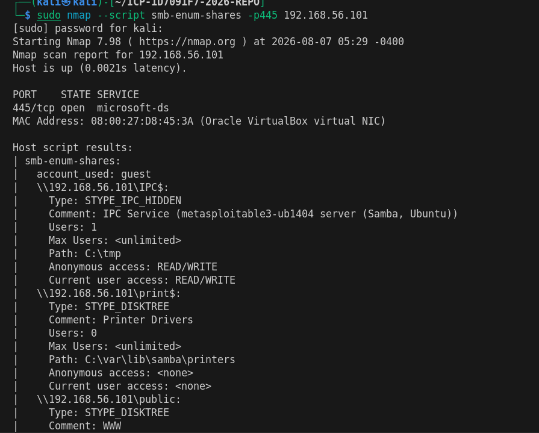

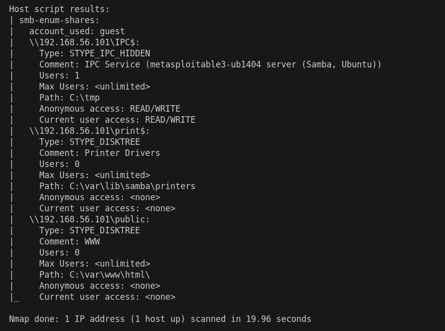


### SMB User Enumeration

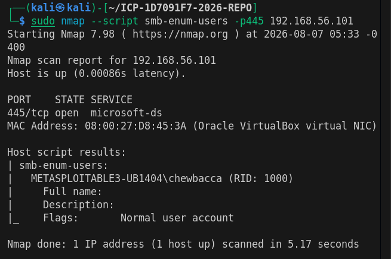


### SMB OS Discovery

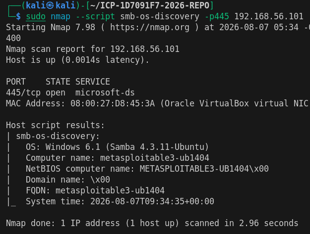


## Findings

SMB enumeration was performed against the target system to identify exposed file-sharing services, available network shares, user accounts, operating system information, and potential security weaknesses within the SMB configuration.

The assessment identified that the target was running Samba services on a Metasploitable3 Ubuntu system. The SMB service was accessible through TCP port 445 and revealed information about the host, including the computer name, operating system details, available shares, and local user accounts.

Enum4linux successfully identified the SMB environment, revealing the hostname `metasploitable3-ub1404`, the domain/workgroup information, and the local user account `chewbacca`. The assessment also identified available SMB shares including `IPC$`, `print$`, and `public`.

The SMB configuration allowed anonymous session enumeration, which enabled the extraction of system information without valid credentials. Additionally, the password policy configuration revealed weak security settings, including a minimum password length of five characters and disabled password complexity requirements.


## SMB Enumeration Findings

| Finding | Description | Risk |
|---------|-------------|------|
| SMB Service Exposure | Samba service accessible on TCP port 445 | Medium |
| Anonymous SMB Access | SMB allows session enumeration without credentials | High |
| User Enumeration | Local account `chewbacca` identified | Medium |
| SMB Shares Discovered | IPC$, print$, and public shares identified | Medium |
| Weak Password Policy | Minimum password length set to 5 characters | High |
| Password Complexity Disabled | Weak authentication requirements configured | High |
| System Information Disclosure | Hostname and OS information exposed | Medium |


## Technical Analysis

SMB enumeration provides valuable information about file-sharing environments by identifying available shares, user accounts, authentication settings, and system configuration details.

The combination of Enum4linux and Nmap SMB NSE scripts provided detailed visibility into the target SMB implementation. The enumeration confirmed that Samba was running on Ubuntu and exposed multiple pieces of information that could assist an attacker during further reconnaissance activities.

The ability to enumerate users and system information without authentication increases the risk of targeted attacks, including password spraying, brute-force attempts, and unauthorized access attempts against valid accounts.


## Security Assessment

The SMB assessment identified several security concerns:

- Anonymous SMB sessions allow unauthorized users to gather system information.
- Exposed SMB shares increase the available attack surface.
- Valid usernames can be identified without authentication.
- Weak password requirements increase the likelihood of successful credential attacks.
- SMB services should not be exposed unnecessarily to untrusted networks.


## Defensive Recommendations

- Disable anonymous SMB access and require authentication.
- Enforce strong password policies with increased minimum length and complexity requirements.
- Restrict SMB access using firewall rules and network segmentation.
- Remove unnecessary SMB shares and limit permissions using the principle of least privilege.
- Regularly update Samba services with security patches.
- Monitor SMB authentication activity for suspicious login attempts.


## Key Takeaway

SMB enumeration successfully identified exposed shares, user accounts, system information, and authentication weaknesses within the target environment. These findings provide important intelligence for later vulnerability assessment and exploitation testing phases.


## Conclusion

The SMB enumeration phase revealed multiple security weaknesses within the target's file-sharing infrastructure. Anonymous enumeration, weak password policies, and exposed SMB information increase the potential attack surface. These findings should be addressed through stronger access controls, improved authentication policies, and secure SMB configuration practices.

---

# FTP Enumeration

## Overview

FTP enumeration was performed against the target system to identify the running FTP service, collect service banner information, analyze authentication mechanisms, enumerate accessible files, and identify potential security weaknesses.

The FTP service was identified during the service enumeration phase as running on TCP port 21. The assessment included banner grabbing, authentication testing, directory listing, and Nmap FTP script enumeration.

---

## Command Output Screenshots

### FTP Service Banner

**Command Executed**

```bash
nc -nv 192.168.56.101 21
```

**Screenshot**

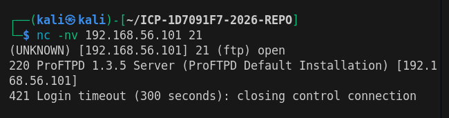

**Results**

```text
220 ProFTPD 1.3.5 Server (ProFTPD Default Installation) [192.168.56.101]
421 Login timeout (300 seconds): closing control connection
```

**Analysis**

The FTP banner identified the service as **ProFTPD 1.3.5**. Service banner disclosure provides valuable information during penetration testing because software versions can be correlated with publicly known vulnerabilities (CVEs) and vendor security advisories.

---

### FTP Authentication Testing

**Command Executed**

```bash
ftp 192.168.56.101
```

**Screenshot**

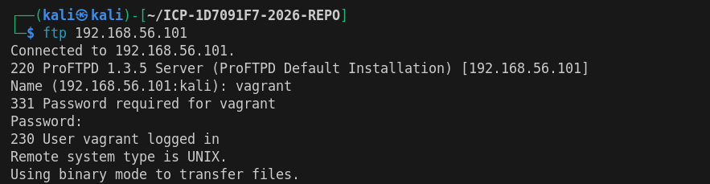

**Results**

Anonymous authentication was tested using the username **anonymous**.

The server responded:

```text
331 Anonymous login ok, send your complete email address as your password
530 Login incorrect
```

Further testing identified valid credentials:

```text
Username: vagrant
Password: vagrant
```

Successful authentication returned:

```text
230 User vagrant logged in
```

**Analysis**

Anonymous authentication was not permitted; however, authentication using the default **vagrant** credentials was successful. The presence of default credentials represents a critical security weakness because unauthorized users can obtain legitimate access to the FTP service.

---

### FTP Directory Enumeration

**Commands Executed**

```text
pwd
ls
dir
syst
```

**Screenshot**

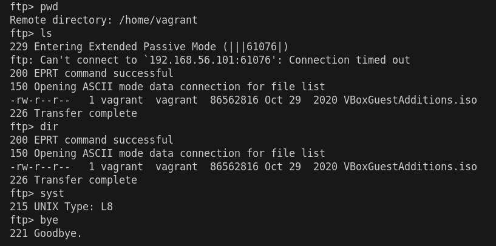

**Results**

The authenticated FTP session revealed:

```text
Remote directory: /home/vagrant
```

Directory contents:

```text
-rw-r--r--   1 vagrant vagrant 86562816 Oct 29 2020 VBoxGuestAdditions.iso
```

System identification:

```text
215 UNIX Type: L8
```

**Analysis**

Authenticated FTP access allowed directory enumeration and file discovery. The exposed file demonstrates that authenticated users can browse resources stored within the FTP directory structure.

---

### Nmap FTP Script Enumeration

**Command Executed**

```bash
sudo nmap --script ftp-anon,ftp-syst -p21 192.168.56.101
```

**Screenshot**

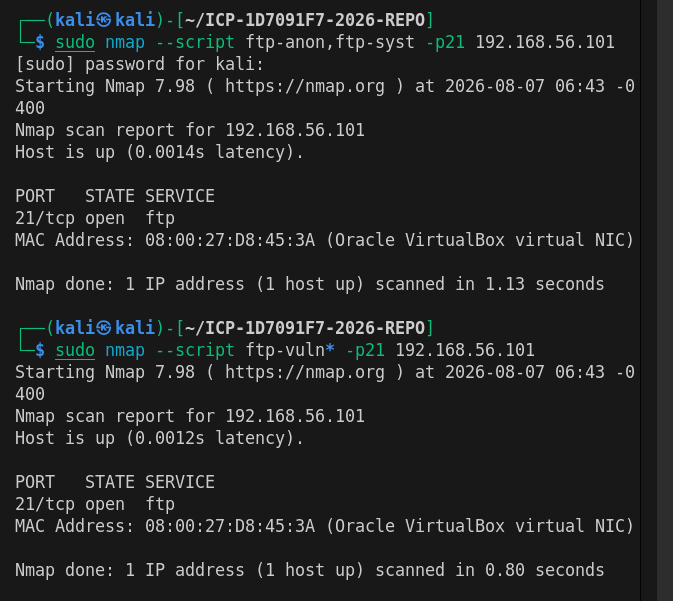

**Results**

```text
PORT   STATE SERVICE
21/tcp open  ftp
```

**Analysis**

The Nmap FTP scripts confirmed that the FTP service was active on TCP port 21. No additional information was disclosed through the automated FTP enumeration scripts.

---

### FTP Vulnerability Scan

**Command Executed**

```bash
sudo nmap --script ftp-vuln* -p21 192.168.56.101
```

**Screenshot**

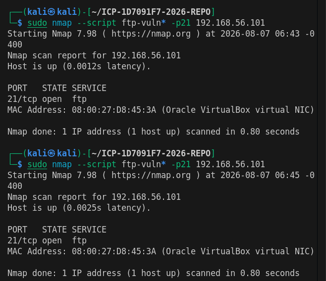

**Results**

```text
PORT   STATE SERVICE
21/tcp open  ftp
```

**Analysis**

The automated FTP vulnerability scripts did not identify any specific vulnerabilities. However, manual testing revealed successful authentication using the default credentials **vagrant:vagrant**, representing a critical security weakness.

---

## FTP Enumeration Findings

| Finding | Description | Risk |
|---------|-------------|------|
| FTP Service Exposure | FTP service accessible on TCP port 21 | Medium |
| ProFTPD Version Disclosure | Service banner identified ProFTPD 1.3.5 | Medium |
| Default Credentials | Successful login using `vagrant:vagrant` | Critical |
| Authenticated FTP Access | Valid credentials allowed remote access | High |
| Anonymous Authentication | Anonymous login attempted but denied | Low |
| File Exposure | Authenticated users could enumerate accessible files | Medium |

---

## Technical Analysis

FTP enumeration confirmed that the target was running **ProFTPD 1.3.5** on TCP port 21. Banner grabbing disclosed the FTP software version, while authentication testing demonstrated that anonymous access was restricted. However, valid default credentials (**vagrant:vagrant**) permitted successful authentication.

Once authenticated, directory enumeration revealed accessible files within the user's home directory, confirming that authenticated users could browse server resources. Although the automated Nmap FTP scripts did not identify additional vulnerabilities, the successful use of default credentials significantly increased the attack surface and could allow an attacker to establish an initial foothold on the system.

---

## Security Assessment

The FTP service presents several security concerns:

- Default credentials allow unauthorized authentication.
- FTP transmits credentials without encryption.
- Service version information is exposed through banner disclosure.
- Authenticated users can enumerate accessible files.
- Exposed FTP services increase the attack surface.

---

## Defensive Recommendations

- Remove all default credentials from FTP accounts.
- Implement strong password policies.
- Disable unused FTP accounts.
- Replace FTP with secure alternatives such as **SFTP** or **FTPS**.
- Restrict FTP access using firewall rules and access controls.
- Disable anonymous authentication where it is not required.
- Upgrade ProFTPD to a supported version.
- Regularly audit FTP directories for sensitive files.
- Monitor FTP authentication logs for suspicious activity.

---

## Key Takeaway

FTP enumeration successfully identified the FTP service, software version, authentication configuration, and accessible resources. The most significant finding was successful authentication using the default credentials **vagrant:vagrant**, providing authenticated access to the server.

---

## Conclusion

The FTP enumeration phase provided valuable insight into the target's FTP configuration and security posture. Although automated vulnerability scripts did not identify exploitable vulnerabilities, manual testing uncovered a critical weakness through the use of default credentials. This finding demonstrates the importance of secure credential management, service hardening, and routine security assessments to reduce the risk of unauthorized access.

---

# SSH Enumeration

## Overview

SSH enumeration was performed against the target system to identify the SSH service version, enumerate supported cryptographic algorithms, collect server host key information, and determine the authentication methods supported by the service.

The SSH service was identified on TCP port 22 during the service enumeration phase. Additional Nmap NSE scripts were used to examine SSH host keys, key exchange algorithms, encryption algorithms, MAC algorithms, and supported authentication mechanisms.

---

## Command Output Screenshots

### SSH Service Identification

**Command Executed**

```bash
sudo nmap -p22 -sV 192.168.56.101
```

**Screenshot**

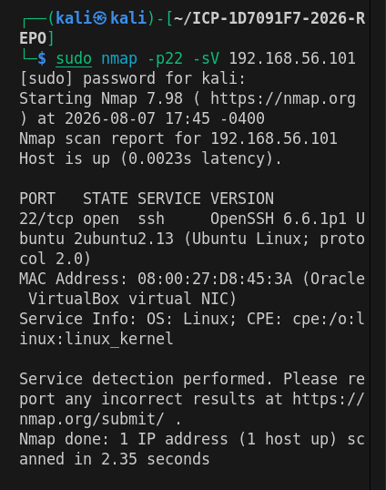

**Results**

```text
PORT   STATE SERVICE VERSION
22/tcp open  ssh     OpenSSH 6.6.1p1 Ubuntu 2ubuntu2.13 (Ubuntu Linux; protocol 2.0)
```

**Analysis**

The target was confirmed to have SSH exposed on TCP port 22. The service was identified as **OpenSSH 6.6.1p1 Ubuntu 2ubuntu2.13** running on a Linux system.

The exposed service version provides useful information for security assessment because older software versions may contain known vulnerabilities or support outdated cryptographic configurations.

---

### SSH Host Key and Algorithm Enumeration

**Command Executed**

```bash
sudo nmap --script ssh-hostkey,ssh2-enum-algos -p22 192.168.56.101
```

**Screenshots**

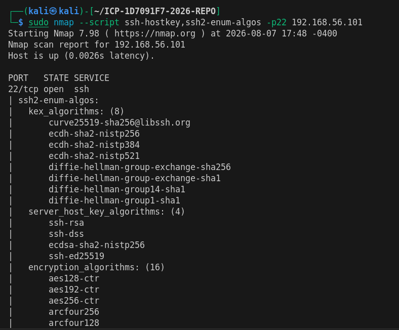

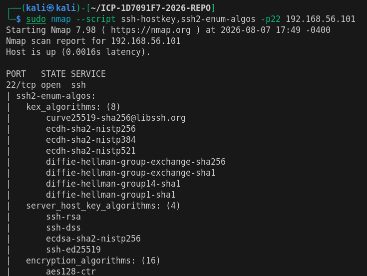

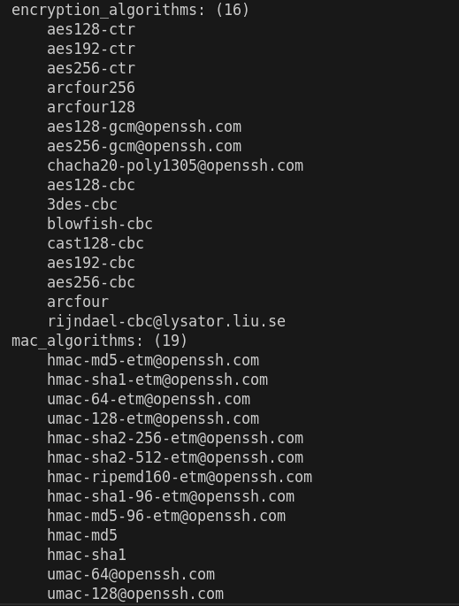

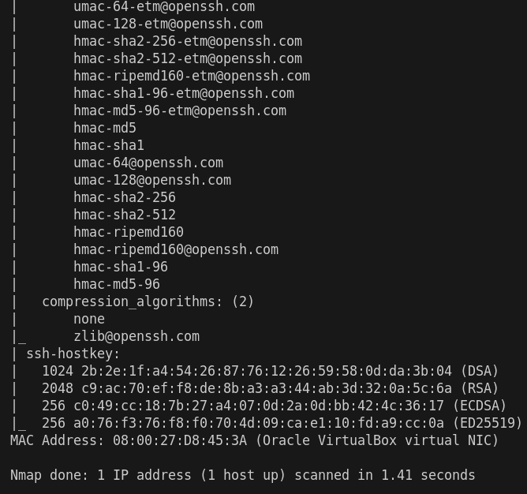

**Results**

The SSH service exposed the following key exchange algorithms:

```text
curve25519-sha256@libssh.org
ecdh-sha2-nistp256
ecdh-sha2-nistp384
ecdh-sha2-nistp521
diffie-hellman-group-exchange-sha256
diffie-hellman-group-exchange-sha1
diffie-hellman-group14-sha1
diffie-hellman-group1-sha1
```

The server supported the following host key algorithms:

```text
ssh-rsa
ssh-dss
ecdsa-sha2-nistp256
ssh-ed25519
```

The service also advertised multiple encryption algorithms, including:

```text
aes128-ctr
aes192-ctr
aes256-ctr
arcfour256
arcfour128
aes128-gcm@openssh.com
aes256-gcm@openssh.com
chacha20-poly1305@openssh.com
aes128-cbc
3des-cbc
blowfish-cbc
cast128-cbc
aes192-cbc
aes256-cbc
arcfour
rijndael-cbc@lysator.liu.se
```

Multiple MAC algorithms were also supported, including MD5- and SHA-1-based options:

```text
hmac-md5
hmac-sha1
hmac-md5-96
hmac-sha1-96
hmac-sha2-256
hmac-sha2-512
hmac-ripemd160
```

The server exposed four SSH host keys:

```text
1024-bit DSA
2048-bit RSA
256-bit ECDSA
256-bit ED25519
```

**Analysis**

The SSH configuration supports several modern cryptographic algorithms, including ED25519, ECDSA, AES-GCM, ChaCha20-Poly1305, and Curve25519.

However, the service also supports several legacy algorithms that should be considered weak or deprecated in modern SSH configurations. These include:

- `diffie-hellman-group1-sha1`
- `diffie-hellman-group14-sha1`
- `diffie-hellman-group-exchange-sha1`
- `ssh-dss`
- `arcfour`
- Multiple CBC-mode encryption algorithms
- MD5-based MAC algorithms
- SHA-1-based MAC algorithms

The presence of these legacy algorithms increases the cryptographic attack surface and may allow clients to negotiate weaker security options if the server does not enforce modern algorithm preferences.

---

### SSH Authentication Methods

**Command Executed**

```bash
sudo nmap --script ssh-auth-methods -p22 192.168.56.101
```

**Screenshot**

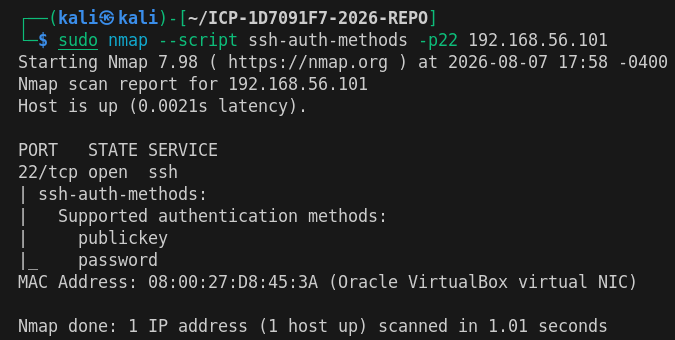

**Results**

The SSH service reported the following supported authentication methods:

```text
Supported authentication methods:
publickey
password
```

**Analysis**

The SSH service supports both public-key and password-based authentication.

Password authentication can increase the risk of brute-force or password-guessing attacks if weak credentials, default passwords, or insufficient account lockout controls are present.

Public-key authentication provides a stronger authentication mechanism when properly configured and protected with appropriate key management practices.

---

## SSH Enumeration Findings

| Finding | Description | Risk |
|---------|-------------|------|
| SSH Service Exposure | SSH accessible on TCP port 22 | Medium |
| OpenSSH Version Disclosure | OpenSSH 6.6.1p1 Ubuntu version identified | Medium |
| Legacy Key Exchange | SHA-1 based Diffie-Hellman algorithms supported | Medium |
| Weak Host Key Algorithm | DSA (`ssh-dss`) supported | Medium |
| Legacy Encryption | RC4 and CBC-based ciphers supported | Medium |
| Weak MAC Algorithms | MD5 and SHA-1 based MAC algorithms supported | Medium |
| Password Authentication | Password-based SSH authentication enabled | Medium |
| Public-Key Authentication | Public-key authentication supported | Low |
| Host Key Exposure | DSA, RSA, ECDSA, and ED25519 host keys identified | Informational |

---

## Technical Analysis

SSH enumeration identified OpenSSH 6.6.1p1 running on TCP port 22. The service provides several modern cryptographic options but also maintains compatibility with a number of legacy algorithms.

The most notable configuration weaknesses include support for SHA-1 based key exchange algorithms, DSA host keys, RC4 encryption, CBC-mode ciphers, and MD5-based MAC algorithms. These algorithms are considered outdated and should generally be removed from modern SSH configurations where compatibility requirements do not justify their use.

The SSH service also supports password authentication. Password authentication is not inherently vulnerable, but it can increase exposure to credential-based attacks when combined with weak passwords, default credentials, unrestricted network access, or inadequate authentication controls.

No direct SSH vulnerability was established through these enumeration commands alone. The findings should therefore be treated as configuration weaknesses requiring further assessment rather than confirmed exploitable vulnerabilities.

---

## Security Assessment

The SSH service presents the following security concerns:

- OpenSSH version information is disclosed.
- Legacy SHA-1 based key exchange algorithms are enabled.
- DSA host key support is enabled.
- RC4 encryption algorithms are supported.
- Multiple CBC-mode encryption algorithms are enabled.
- MD5 and SHA-1 based MAC algorithms are supported.
- Password authentication is enabled.
- The SSH service is exposed on the network and therefore represents an accessible authentication surface.

---

## Defensive Recommendations

- Upgrade OpenSSH to a currently supported version.
- Disable deprecated SHA-1 based key exchange algorithms.
- Disable `ssh-dss` and other obsolete host key algorithms.
- Disable RC4/Arcfour encryption algorithms.
- Disable unnecessary CBC-mode ciphers.
- Remove MD5-based MAC algorithms.
- Remove weak SHA-1 based MAC algorithms where compatibility permits.
- Prefer modern algorithms such as ED25519, Curve25519, AES-GCM, and ChaCha20-Poly1305.
- Use strong passwords and enforce appropriate password policies.
- Consider disabling password authentication where public-key authentication is practical.
- Restrict SSH access to authorized hosts and management networks.
- Implement rate limiting, account lockout controls, or equivalent protections against repeated authentication attempts.
- Monitor SSH authentication logs for suspicious activity.

---

## Key Takeaway

SSH enumeration confirmed that the target exposes OpenSSH 6.6.1p1 on TCP port 22 and supports both password and public-key authentication. Although modern cryptographic algorithms are available, the service also supports numerous legacy algorithms that increase the attack surface and should be disabled in a hardened environment.

---

## Conclusion

The SSH enumeration phase provided detailed information about the target's SSH service, cryptographic configuration, host keys, and authentication mechanisms.

The assessment identified several security configuration weaknesses, particularly the continued support for legacy SHA-1, MD5, DSA, RC4, and CBC-based algorithms. Password authentication was also enabled, increasing the importance of strong credential controls and access restrictions.

No direct exploitable SSH vulnerability was confirmed through the enumeration performed. However, upgrading the SSH service and removing deprecated cryptographic algorithms would significantly improve the security posture of the target.

---

# 9. Vulnerability Assessment

## 9.1 Overview

A vulnerability assessment was performed against the Metasploitable target using Nmap's NSE vulnerability detection scripts. The assessment focused on the TCP services identified during the previous scanning and enumeration phases: FTP (21), SSH (22), HTTP (80), SMB (445), and IPP (631).

The purpose of this assessment was to identify known or potentially exploitable weaknesses in exposed services and web applications without performing exploitation. The results provide an initial indication of vulnerabilities that would require further validation during a controlled penetration testing engagement.

## Vulnerability Assessment Overview

The vulnerability assessment workflow consisted of:

1. Identifying exposed services through TCP scanning.
2. Running Nmap vulnerability detection scripts against the identified services.
3. Reviewing the returned vulnerability indicators and affected application paths.
4. Assessing the potential security impact.
5. Identifying appropriate defensive recommendations.

## 9.2 Vulnerability Assessment Scan

### Command Used

The following Nmap NSE vulnerability detection scan was performed against the identified TCP services:

```bash
sudo nmap --script vuln -p21,22,80,445,631 192.168.56.101
```

The `--script vuln` option instructs Nmap to run vulnerability detection scripts against the target. The `-p21,22,80,445,631` option limits the assessment to the previously identified FTP, SSH, HTTP, SMB, and IPP services.

### Scan Output

The vulnerability assessment returned several security findings, primarily affecting the HTTP and SMB services.

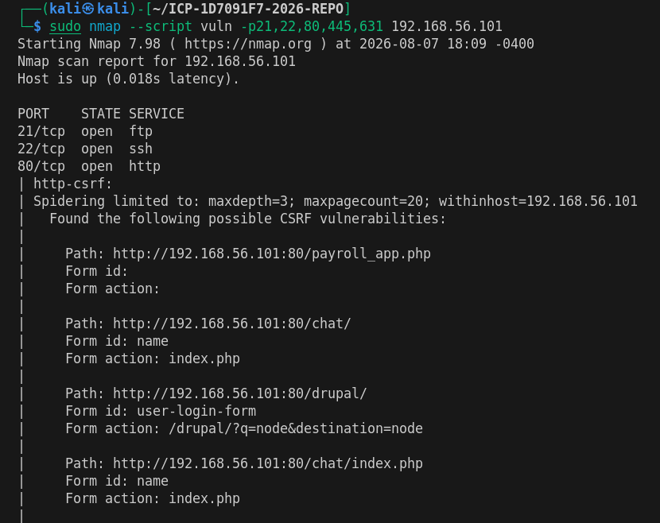

**Figure 9.1:** Nmap vulnerability assessment output showing HTTP-related security findings.

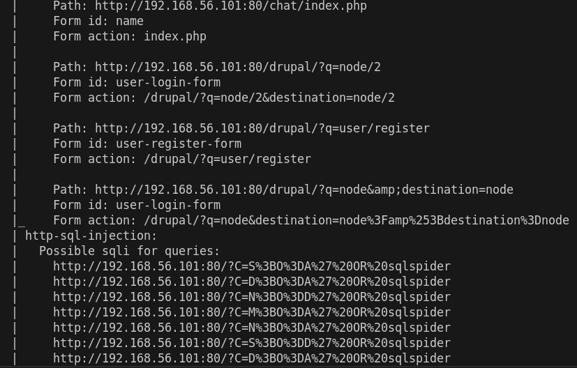

**Figure 9.2:** Nmap vulnerability assessment output showing additional HTTP findings.

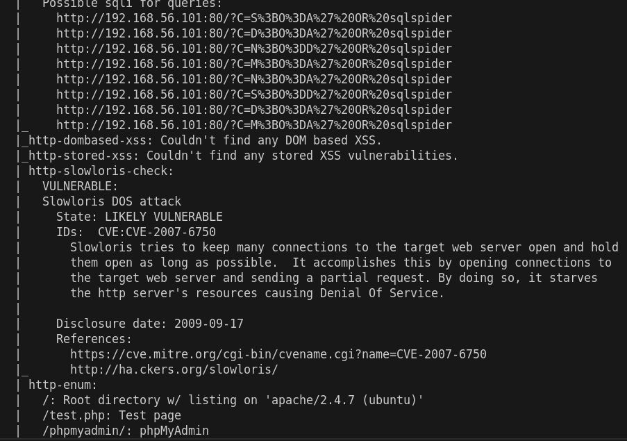

**Figure 9.3:** Nmap vulnerability assessment output showing Slowloris and HTTP enumeration findings.

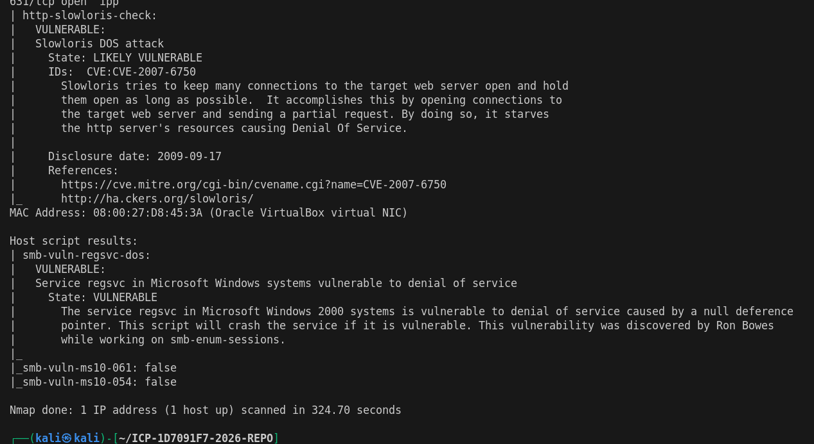

**Figure 9.4:** Nmap vulnerability assessment output showing SMB vulnerability results.

## 9.3 Findings

The vulnerability assessment identified several security weaknesses and potential vulnerabilities affecting the target system. The most significant findings were associated with the HTTP and SMB services.

### 9.3.1 Cross-Site Request Forgery (CSRF)

The `http-csrf` NSE script identified several web forms that may be susceptible to Cross-Site Request Forgery (CSRF). Potentially affected locations included:

* `/payroll_app.php`
* `/chat/`
* `/chat/index.php`
* `/drupal/`
* `/drupal/?q=user/register`
* Drupal login forms

These findings indicate that some web forms may not implement adequate anti-CSRF protections. The results should be manually validated because Nmap identifies potential CSRF conditions rather than confirming exploitability.

### 9.3.2 Possible SQL Injection

The `http-sql-injection` NSE script reported possible SQL injection conditions in HTTP query parameters.

These results should be treated as potential indicators rather than confirmed SQL injection vulnerabilities. Manual validation would be required to determine whether the identified parameters can actually influence backend database queries.

### 9.3.3 Slowloris Denial-of-Service

The HTTP service was reported as **LIKELY VULNERABLE** to the Slowloris denial-of-service condition associated with **CVE-2007-6750**.

Slowloris is an application-layer denial-of-service technique that attempts to maintain multiple incomplete HTTP connections by sending requests slowly. This can consume server resources and potentially prevent legitimate users from accessing the web application.

### 9.3.4 HTTP Information Exposure

The `http-enum` NSE script identified several accessible web resources, including:

* Root directory listing
* `/test.php`
* `/phpmyadmin/`
* `/uploads/`

Exposed directories, administrative interfaces, and testing files can provide useful information to an attacker and may increase the attack surface of the web server.

### 9.3.5 SMB Registry Service Denial-of-Service

The `smb-vuln-regsvc-dos` NSE script reported the SMB service as **VULNERABLE** to a denial-of-service condition affecting the Windows `regsvc` service.

The assessment also checked for MS10-061 and MS10-054 vulnerabilities. Both were reported as **false**, indicating that those specific vulnerabilities were not detected during this scan.

## 9.4 Technical Analysis

The vulnerability assessment demonstrates that the target exposes multiple services with security weaknesses. The most significant findings were associated with the HTTP and SMB services.

The HTTP service presented several potential application-layer weaknesses, including CSRF indicators, possible SQL injection conditions, and a likely Slowloris susceptibility. The presence of directory listings and accessible resources such as phpMyAdmin and an uploads directory also increases information exposure.

The SMB assessment identified a potential denial-of-service condition associated with the `regsvc` service. Although this finding does not directly demonstrate remote code execution or unauthorized access, successful exploitation could affect service availability.

It is important to distinguish between automated vulnerability indicators and confirmed vulnerabilities. Nmap's NSE vulnerability scripts use automated detection techniques and may produce findings that require additional manual verification. Therefore, the results from this assessment should be considered an initial vulnerability assessment rather than proof of exploitability.

Further testing in an authorized laboratory environment would be required to validate the identified findings, determine their actual impact, and establish appropriate severity ratings.

## 9.5 Security Observations

The vulnerability assessment identified several weaknesses that could increase the overall attack surface of the target system.

The HTTP service represents the most significant area of concern. Potential CSRF and SQL injection conditions indicate weaknesses that could affect the security of web applications hosted on the server. The likely Slowloris condition also introduces a potential availability risk.

The exposure of directory listings, phpMyAdmin, test files, and an uploads directory provides additional information that could assist an attacker during reconnaissance. Administrative and development resources should not be unnecessarily exposed to untrusted users.

The SMB finding further demonstrates the risk associated with maintaining legacy or unnecessary network services. Vulnerable services should be patched, disabled, or appropriately isolated where possible.

Overall, the findings indicate that the target would benefit from stronger application security controls, service hardening, access restrictions, patch management, and removal of unnecessary legacy services.

## 9.6 Defensive Recommendations

The following defensive measures are recommended based on the findings identified during the vulnerability assessment:

* **Implement CSRF protection:** Use unpredictable anti-CSRF tokens for state-changing web forms and validate requests on the server side.
* **Prevent SQL injection:** Use parameterized queries or prepared statements and validate all user-controlled input before processing it.
* **Harden the web server:** Apply current security updates and configure Apache to reduce exposure to slow HTTP request attacks such as Slowloris.
* **Disable directory listing:** Prevent unnecessary directory browsing and restrict access to files and directories that do not need to be publicly accessible.
* **Remove unnecessary resources:** Remove test files such as `/test.php` and restrict access to administrative interfaces such as phpMyAdmin.
* **Secure upload directories:** Restrict access to `/uploads/` and prevent uploaded files from being executed as server-side code.
* **Harden SMB:** Disable unnecessary SMB services and apply appropriate security updates to vulnerable services.
* **Apply network access controls:** Use firewall rules and network segmentation to restrict access to administrative and legacy services.
* **Strengthen authentication:** Disable unnecessary password-based authentication where appropriate and enforce strong credentials and access controls.
* **Maintain regular patching:** Keep the operating system, web server, applications, and network services updated with supported security releases.
* **Validate automated findings:** Perform controlled manual verification of vulnerability indicators before assigning final severity or remediation priority.

## 9.7 Key Takeaway

The vulnerability assessment identified multiple security weaknesses across the target's HTTP and SMB services. The most notable findings included potential CSRF and SQL injection conditions, a likely Slowloris denial-of-service vulnerability, exposed web resources, and an SMB denial-of-service vulnerability.

These findings demonstrate the importance of combining automated vulnerability detection with manual validation, secure application development, service hardening, patch management, and appropriate access controls.

## 9.8 Conclusion

The Nmap NSE vulnerability assessment provided an additional layer of security analysis following host discovery, port scanning, service identification, and enumeration. The assessment identified several potential weaknesses that could affect the confidentiality, integrity, or availability of the target system.

The results also demonstrate the value of vulnerability scanning as part of a structured security assessment. Automated NSE scripts can efficiently identify potential security issues across exposed services, while manual validation is necessary to confirm exploitability and determine the actual risk associated with each finding.

Overall, the assessment provided a clear picture of the target's security weaknesses and highlighted areas requiring remediation, particularly the HTTP and SMB services. In a real-world penetration testing engagement, the identified findings would be validated, prioritized according to risk, and followed by appropriate remediation and retesting.


---

# Findings Summary

*To be completed.*

---

# Recommendations

*To be completed.*

---

# Conclusion

*To be completed.*

---

# References

- Nmap Official Documentation
- Kali Linux Documentation
- Metasploitable3 Documentation

---

# Appendix

Additional screenshots, raw scan outputs, and supporting evidence are stored in the `screenshots/`, `scans/`, and `docs/` directories.