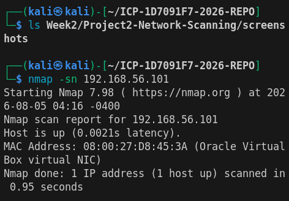
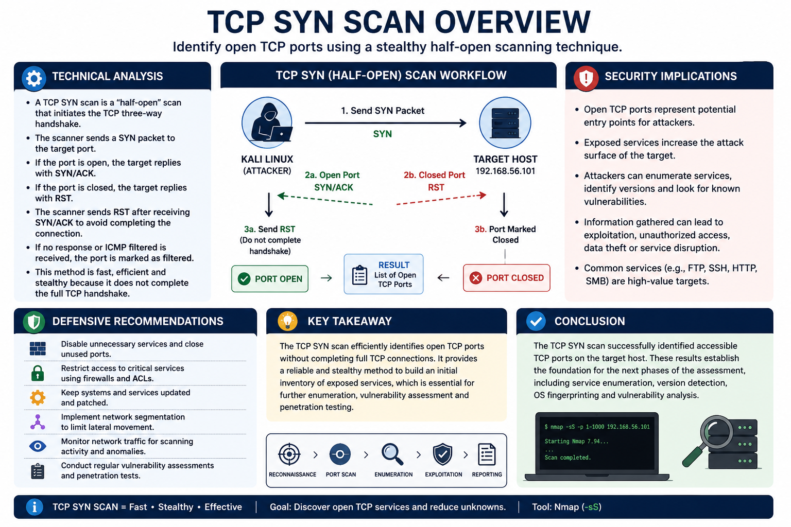
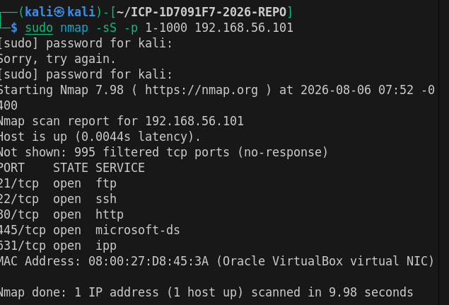
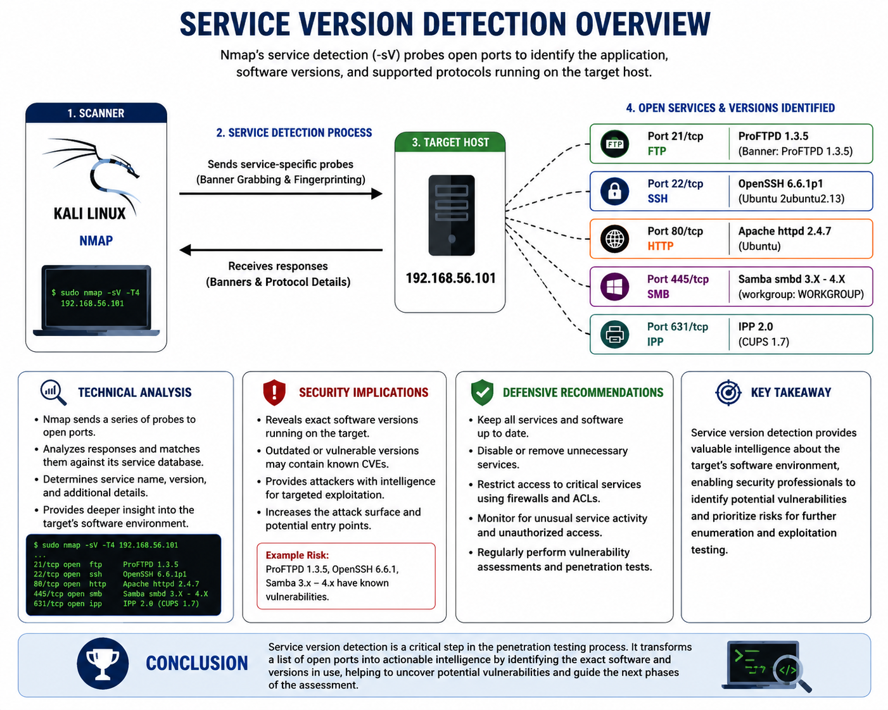
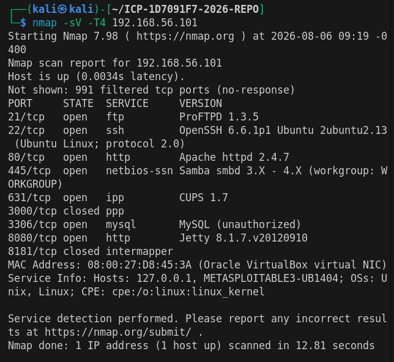

# Week 2 – Network Scanning & Enumeration

## Professional Network Assessment Report

## Project Overview

This project demonstrates a comprehensive network scanning and enumeration assessment conducted against a Metasploitable3 virtual machine using Kali Linux. The objective was to identify live hosts, discover open ports, enumerate running services, identify the target operating system, and collect information that could support a penetration testing engagement.

All testing was performed in a controlled lab environment with authorization. Industry-standard tools such as Nmap and the Nmap Scripting Engine (NSE) were used to perform reconnaissance and service enumeration while documenting the findings in a professional report.

## Introduction

Network reconnaissance is a critical phase of penetration testing and security assessments, as it enables security professionals to identify active hosts, discover open ports, determine running services, and gather information about target systems before conducting further analysis. One of the most widely used tools for this purpose is Nmap (Network Mapper), an open-source network scanning utility capable of performing a variety of host discovery and port scanning techniques.

This assessment was conducted against a Metasploitable3 virtual machine within an isolated lab environment for educational purposes. All activities were performed with proper authorization.

## Objectives

- Verify target host availability.
- Discover open TCP and UDP ports.
- Identify running services and software versions.
- Perform operating system fingerprinting.
- Enumerate services using Nmap NSE scripts.
- Assess potential vulnerabilities.
- Document findings in a professional technical report.

## Lab Environment

| Component | Details |
|-----------|---------|
| Attacker Machine | Kali Linux |
| Target Machine | Metasploitable3 |
| Virtualization Platform | Oracle VirtualBox |
| Network Configuration | Host-Only Network |
| Primary Tool | Nmap 7.98 |
| Assessment Type | Authorized Lab Assessment |

## Table of Contents

- [Executive Summary](#executive-summary)
- [Engagement Overview](#engagement-overview)
- [Assessment Methodology](#assessment-methodology)
- [Lab Environment](#lab-environment)
- [Reconnaissance and Host Discovery](#reconnaissance-and-host-discovery)
- [TCP Port Scanning](#tcp-port-scanning)
- [Service Enumeration](#service-enumeration)
- [Operating System Detection](#operating-system-detection)
- [NSE Script Scanning](#nse-script-scanning)
- [UDP Port Scanning](#udp-port-scanning)
- [Web Enumeration](#web-enumeration)
- [SMB Enumeration](#smb-enumeration)
- [FTP Enumeration](#ftp-enumeration)
- [SSH Enumeration](#ssh-enumeration)
- [Vulnerability Assessment](#vulnerability-assessment)
- [Findings Summary](#findings-summary)
- [Recommendations](#recommendations)
- [Conclusion](#conclusion)
- [References](#references)
- [Appendix](#appendix)

---

# Executive Summary

*To be completed as the assessment progresses.*

---

# Engagement Overview

*To be completed.*

---

# Assessment Methodology

The assessment followed a structured reconnaissance methodology using Nmap to identify active hosts, discover open ports, identify running services, perform operating system detection, and enumerate available network services.

---

# Reconnaissance and Host Discovery

The first phase of the assessment was to determine whether the target host was online and reachable. Nmap host discovery confirmed that the Metasploitable3 virtual machine was active on the network.

## Host Discovery Overview



## Command Used

```bash
nmap -sn 192.168.56.101
```

## Scan Output Screenshot


## Findings

- Host successfully responded to ICMP requests.
- Target was confirmed online.
- MAC address identified as Oracle VirtualBox virtual NIC.
- Ready for further enumeration.

---

# TCP Port Scanning

## Overview

Following successful host discovery, a TCP SYN scan was performed to identify open TCP ports on the target system. The TCP SYN scan, commonly referred to as a half-open scan, is one of Nmap's most efficient reconnaissance techniques for discovering active network services. Instead of completing the full TCP three-way handshake, the scanner sends a SYN packet and analyzes the target's response to determine whether a port is open, closed, or filtered.

This scanning technique enables security professionals to rapidly enumerate exposed services while generating minimal network traffic. The results obtained during this phase establish the foundation for subsequent service enumeration, operating system fingerprinting, and vulnerability assessment activities.

## TCP SYN Scan Overview



## Command Used

```bash
sudo nmap -sS -p 1-1000 192.168.56.101
```

## Command Output Screenshot



## Findings

The TCP SYN scan successfully identified five open TCP ports on the target system within the first 1,000 TCP ports scanned. These ports indicate active services that are accessible over the network and warrant further enumeration.

| Port | State | Service |
|------|-------|---------|
| 21 | Open | FTP |
| 22 | Open | SSH |
| 80 | Open | HTTP |
| 445 | Open | Microsoft-DS (SMB) |
| 631 | Open | Internet Printing Protocol (IPP) |

Additionally, Nmap reported that 995 TCP ports were filtered (no response), indicating that probe packets did not receive a reply from the target. The target host responded with a low latency of approximately 1.4 ms, confirming reliable connectivity within the isolated laboratory environment.


---

## Technical Analysis

The TCP SYN scan utilized Nmap's half-open scanning technique to identify the state of TCP ports without completing the full TCP three-way handshake. During the scan, Nmap transmitted TCP SYN packets to the target system and analyzed the responses to determine the state of each port.

An open port responded with a SYN/ACK packet, indicating that a service was actively listening for incoming connections. Nmap then immediately terminated the connection by sending a Reset (RST) packet, preventing the handshake from completing. Closed ports responded with an RST packet, while filtered ports either failed to respond or were blocked by network filtering devices such as firewalls or packet filtering rules.

The scan completed in approximately 5.97 seconds and identified five accessible TCP services on the target host. These services provide the foundation for subsequent service version detection, operating system fingerprinting, vulnerability assessment, and service-specific enumeration during the later phases of the engagement.

## Security Assessment

The TCP SYN scan revealed multiple network services exposed on the target system, including FTP, SSH, HTTP, SMB, and IPP. Each exposed service represents a potential entry point that could be exploited if vulnerabilities, weak configurations, or outdated software are present.

The presence of FTP may expose risks associated with insecure authentication or anonymous access if not properly configured. SSH is generally considered secure but may be susceptible to brute-force attacks or weak credential policies. The HTTP service may expose web application vulnerabilities, while SMB has historically been associated with several high-impact vulnerabilities when left unpatched or misconfigured. The Internet Printing Protocol (IPP) should also be reviewed to ensure it is necessary and securely configured.

Although a TCP SYN scan does not directly identify vulnerabilities, it provides a comprehensive inventory of exposed services that should be prioritized for further enumeration, version detection, and targeted security testing during the subsequent phases of the assessment.

## Defensive Recommendations

To reduce the attack surface identified during the TCP SYN scan, the following security measures are recommended:

* Disable or remove unnecessary network services that are not required for business operations.
* Restrict access to critical services such as SSH and SMB using firewall rules, network segmentation, or access control lists (ACLs).
* Regularly apply security patches and software updates to all exposed services.
* Replace insecure protocols with secure alternatives where appropriate and enforce strong authentication mechanisms.
* Monitor network traffic for unauthorized scanning activity using intrusion detection or intrusion prevention systems (IDS/IPS).
* Conduct routine network vulnerability assessments and penetration tests to identify newly exposed services and validate existing security controls.

## Key Takeaway

The TCP SYN scan efficiently identified the target's exposed TCP services while minimizing network traffic through the use of the half-open scanning technique. The results established a reliable inventory of accessible network services, providing the necessary foundation for service enumeration, operating system detection, and vulnerability assessment during the subsequent phases of the penetration testing engagement.

## Conclusion

The TCP SYN scan successfully identified five open TCP ports and confirmed the availability of several network services on the target system. The information gathered during this phase established the target's network exposure and provided a structured basis for deeper service enumeration and security analysis. The next phase of the assessment will focus on identifying service versions and software banners to determine potential vulnerabilities associated with each exposed service.

# Service Version Detection

## Overview

Following the identification of open TCP ports, a service version detection scan was performed to determine the applications and software versions running on each exposed service. Nmap's service detection engine probes open ports using protocol-specific requests and analyzes the responses to accurately identify running services, software versions, and supported protocols.

This information enables security professionals to identify outdated software, correlate versions with publicly disclosed vulnerabilities (CVEs), and prioritize systems requiring remediation or further investigation during a penetration testing engagement.

## Service Version Detection Overview



## Command Used

```bash
sudo nmap -sV -T4 192.168.56.101
```
## Command Output Screenshot



## Findings

The service version detection scan successfully identified the software and version information associated with the exposed network services on the target system. In addition to confirming the previously discovered open ports, the scan revealed specific applications, service banners, and operating system information that support further vulnerability assessment.

| Port | Service | Version |
|------|---------|---------|
| 21 | FTP | ProFTPD 1.3.5 |
| 22 | SSH | OpenSSH 6.6.1p1 Ubuntu 2ubuntu2.13 |
| 80 | HTTP | Apache httpd 2.4.7 (Ubuntu) |
| 445 | SMB | Samba smbd 3.X–4.X |
| 631 | IPP | CUPS 1.7 |
| 3306 | MySQL | MySQL (unauthorized) |
| 8080 | HTTP | Jetty 8.1.7.v20120910 |

The scan also identified two closed ports (3000 and 8181), confirmed the target hostname as **METASPLOITABLE3-UB1404**, and identified the operating system as a Unix/Linux-based host. The scan completed in approximately **12.85 seconds**.

---

## Technical Analysis

Nmap's service version detection (`-sV`) performs active fingerprinting by sending protocol-specific probes to each discovered open port and analyzing the responses. The collected banners are compared against Nmap's service fingerprint database to accurately identify applications, software versions, and supported protocols.

The scan successfully identified several commonly deployed services, including ProFTPD, OpenSSH, Apache HTTP Server, Samba, CUPS, MySQL, and Jetty. This information provides a detailed inventory of the software running on the target system and establishes the foundation for vulnerability research by correlating identified versions with publicly disclosed Common Vulnerabilities and Exposures (CVEs).

---

## Security Assessment

The service version detection scan identified multiple applications and software versions that should be evaluated against publicly disclosed vulnerabilities and vendor security advisories. Services such as ProFTPD, Apache HTTP Server, Samba, Jetty, and CUPS have historically been associated with security vulnerabilities when running outdated or unsupported versions.

The MySQL service responded with an **"unauthorized"** message, confirming that the database service is reachable over the network. Although authentication prevented access during this phase, unnecessary exposure of database services increases the attack surface and should be carefully reviewed.

The operating system fingerprint also confirmed that the target is a Linux-based host, providing valuable context for subsequent enumeration and vulnerability assessment. While the version detection scan does not directly identify exploitable vulnerabilities, it supplies the critical information required to prioritize further testing.

---

## Defensive Recommendations

- Regularly update exposed services to supported versions with the latest security patches.
- Disable or remove services that are not required for operational purposes.
- Restrict access to SSH, MySQL, and SMB using firewall rules or network segmentation.
- Limit exposure of web applications and administrative interfaces to trusted networks.
- Perform regular vulnerability assessments to identify outdated software.
- Continuously monitor exposed services for configuration changes and suspicious activity.

---

## Key Takeaway

Service version detection provides a detailed inventory of the software running on exposed network services. This information enables security professionals to correlate identified versions with known vulnerabilities, prioritize remediation efforts, and focus subsequent penetration testing activities on the systems presenting the highest potential risk.

---

## Conclusion

The service version detection scan successfully identified the applications, software versions, and operating system information associated with the target's exposed services. These findings provide the technical foundation required for vulnerability assessment, service-specific enumeration, and informed security decision-making during the remaining phases of the penetration testing engagement.


# Service Enumeration

*To be completed.*

---

# Operating System Detection

*To be completed.*

---

# NSE Script Scanning

*To be completed.*

---

# UDP Port Scanning

*To be completed.*

---

# Web Enumeration

*To be completed.*

---

# SMB Enumeration

*To be completed.*

---

# FTP Enumeration

*To be completed.*

---

# SSH Enumeration

*To be completed.*

---

# Vulnerability Assessment

*To be completed.*

---

# Findings Summary

*To be completed.*

---

# Recommendations

*To be completed.*

---

# Conclusion

*To be completed.*

---

# References

- Nmap Official Documentation
- Kali Linux Documentation
- Metasploitable3 Documentation

---

# Appendix

Additional screenshots, raw scan outputs, and supporting evidence are stored in the `screenshots/`, `scans/`, and `docs/` directories.